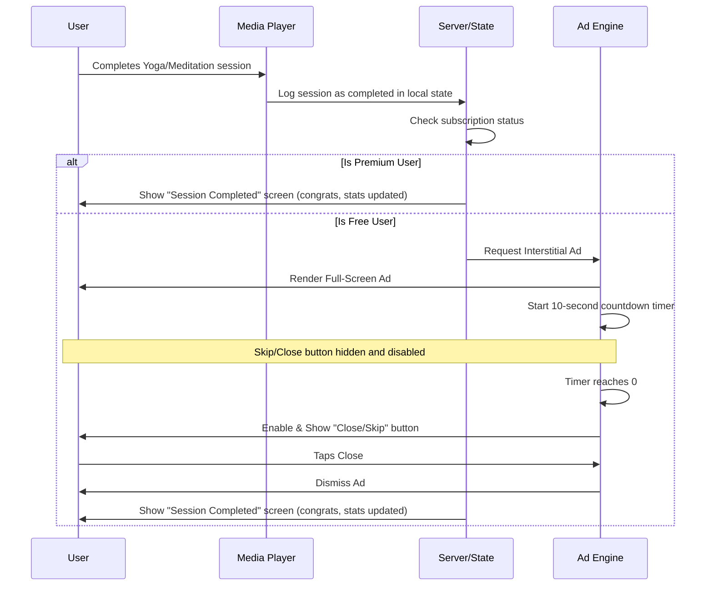

# Product Requirements Document (PRD) — Sadhana

> **Phase:** 1 (Discovery & Strategy)
> **Skill Used:** `product-manager-toolkit`
> **Last Updated:** 2026-06-15
> **Status:** Draft / Awaiting Review

---

## 1. Introduction & Objectives

### Problem Statement
Modern professionals, parents, and students face unprecedented levels of stress, anxiety, and physical burnout. While the market contains hundreds of wellness apps, they are heavily fragmented. Mental wellness apps (Calm, Headspace) focus solely on cognitive mindfulness, whereas yoga apps (Down Dog, Asana Rebel) treat it strictly as a physical fitness workout. 

Furthermore, global users are increasingly seeking authentic Eastern practices, yet they find them either over-secularized or poorly formatted for modern schedules. There is no unified mobile platform that integrates physical postures (*Asana*), conscious breathwork (*Pranayama*), and meditation (*Dhyana*) into a cohesive daily routine (*Sadhana*) tailored for busy lifestyles.

### Solution Overview
A premium, cross-platform mobile application (built on React Native + Expo) that acts as a daily wellness sanctuary. It offers integrated daily routines (e.g., a 15-minute Morning Sadhana combining stretching, breathing, and meditation) rooted in authentic Indian traditions, backed by modern neuroscience, and delivered via high-quality audio and video streaming.

### Business Goals & Success Metrics
The target MVP launch is **3 weeks**. We will track success using the following metrics:

| Metric | Target | Tracked Via |
|--------|--------|-------------|
| **D1 Retention** | >25% | Analytics (Amplitude/Mixpanel) |
| **D7 Retention** | >12% | Analytics (Amplitude/Mixpanel) |
| **D30 Retention** | >5% | Analytics (Amplitude/Mixpanel) |
| **Onboarding Completion** | >70% | Funnel tracking |
| **Crash-Free Rate** | >99.5% | Sentry dashboard |
| **Free-to-Premium Conversion** | 2% - 5% | Subscription analytics (RevenueCat/Stripe) |
| **Ad Retention Rate** | <15% churn | Analytics on ad-trigger drop-offs |

---

## 2. Target Audience & User Profiles

### Demographics & Geographics
*   **Age:** 25–70 years old.
*   **Roles:** Professionals, entrepreneurs, busy parents, and students.
*   **Geographic Focus:** United States, Canada, European Union, and English-speaking international markets.
*   **Technical Comfort:** Moderate to high (comfortable with mobile apps, subscriptions, and casting to TVs).

### User Personas
1.  **"Busy Achiever" Sarah (32, US):** An entrepreneur working 60-hour weeks. Suffers from sleep anxiety and neck tension from desk work. Wants brief, high-yield morning routines (10-15 mins) that combine stretching with mental grounding.
2.  **"Authenticity Seeker" Michael (45, Canada):** A school teacher who has practiced yoga at local studios. He is frustrated by Westernized fitness-only yoga and wants to understand the philosophy, Sanskrit terminology, and pranayama roots.
3.  **"Restorative Senior" Elena (68, EU):** A retired grandmother looking to maintain joint mobility and find emotional balance. Needs gentle, audio-heavy guided breathing and seated stretching.

---

## 3. Product Scope & Prioritization (MoSCoW)

To hit our **3-week MVP deadline**, features are strictly triaged:

### Must Have (MVP — Current Focus)
1.  **Secure Authentication:** Signup, login, logout, and password recovery. Must support session persistence.
2.  **Guided Media Player:**
    *   **Audio player:** For meditations and breathwork. Supports play, pause, seek, scrub, background play, and lock screen controls.
    *   **Video player:** For yoga routines. Supports play, pause, full-screen mode, and landscape orientation.
3.  **Core Content Library:**
    *   *Free:* Daily meditation session, beginner-friendly yoga routines, basic breathwork.
    *   *Premium:* Full yoga library, advanced breathwork (Pranayama), sleep & stress programs.
4.  **Habit & Progress Tracking:**
    *   Visual calendar showing active days.
    *   Daily streak counter to build user consistency.
    *   Stat tracking (total minutes practiced, sessions completed).
5.  **Monetization — Full-Screen Interstitial Ads:**
    *   *Target:* Free tier users.
    *   *Trigger:* Triggered immediately upon completion of any session (yoga, meditation, breathwork) or during tab transitions (capped at 1 ad per 15 minutes).
    *   *Logic:* Ad must be full-screen, displaying a mandatory **10-second visual countdown timer**. The close/skip button is disabled and hidden until the timer reaches zero.
6.  **Monetization — Subscriptions:**
    *   Paywall screen showing monthly/annual subscription options.
    *   Gating of premium media content.
    *   "Restore Purchases" capability (mandatory for App Store approval).
7.  **Sadhana Rewards System (Ad Incentives):**
    *   Point-based reward mechanics for both Free and Paid tiers.
    *   Tracking monthly ad views with milestone notifications.
    *   Tier-specific reward structures (Free: premium unlocks/ad-free passes; Paid: redeemable Karma Coins).
8.  **Personalized Sadhana Planner (Premium Only):**
    *   Onboarding questionnaire inputs (goals, physical tightness, level) dynamically generate a customized daily routine (Asana + Pranayama + Dhyana) tailored specifically to the user.
    *   *Gating:* Locked behind subscription paywall. Free tier users receive a static, non-personalized "Global Daily Sadhana".

### Should Have (MVP — High Priority)
1.  **Offline Downloads:** Premium users can download audio and video sessions locally for offline use (e.g., traveling, outdoors).
2.  **Notification Reminders:** Basic local daily push notifications to remind users to complete their daily *Sadhana* at their preferred time.
3.  **GDPR Compliance Controls:** Account deletion request buttons inside settings, strict opt-in consent pop-up for EU users on launch, and dynamic data-safety disclosures.

### Could Have (V2 — Post-MVP)
1.  **AI Wellness Coach:** Interactive chatbot guided by authentic yogic scriptures and modern science to answer wellness questions and recommend practices.
3.  **Wearable Syncing:** Connecting with Apple HealthKit / Google Fit to track heart rate variability (HRV) and calories during yoga/pranayama.
4.  **Community & Social:** Group challenges, milestone sharing, and teacher Q&A forums.

### Won't Have (V3+ / Future)
1.  **Native Tablet UI Layouts:** The app will run in compatibility scaling mode on tablets for MVP; dedicated layouts are deferred.
2.  **Apple TV, Android TV, and Web Platforms:** Deferred to maximize focus on the mobile-first React Native experience.

---

### 3.3 Sadhana Rewards System
To incentivize and reward user engagement while maintaining a healthy ad-based monetization stream, Sadhana implements a monthly ad-viewing reward cycle available to both Free and Premium tiers, with tier-specific reward limitations.

#### Core Mechanics:
1.  **Ad Tracking:** The app tracks the number of full-screen ads viewed by each user within a calendar month. The count resets to `0` at midnight (user's local time) on the first day of each month.
2.  **Tracking Method:** Successful ad dismissals trigger a secure server-side increment of the user's monthly ad count in the database (verified via ad-network callbacks to prevent client-side spoofing).
3.  **Reward Tiers & Limits:**

| Monthly Milestone | Free Tier Rewards | Premium Tier Rewards |
|-------------------|-------------------|----------------------|
| **Tier 1 (10 Ads)** | Unlock **1 Premium Single Session** of choice (valid for the current month). | Earn **10 Karma Coins** in permanent wallet. |
| **Tier 2 (30 Ads)** | Unlock **1 Premium Guided Course Bundle** (valid for the current month). | Earn **30 Karma Coins** in permanent wallet. |
| **Tier 3 (50 Ads)** | Unlock a **24-Hour Ad-Free Pass** (can be activated on demand). | Earn **50 Karma Coins** in permanent wallet. |

#### Karma Coins Redemption (Premium Only):
Karma Coins are stored in the user's permanent wallet and do not expire. Premium users can redeem them for:
-   **Subscription Discounts:** 100 Karma Coins = $5 off subscription renewal.
-   **Wellness Gear Discounts:** Partner coupon codes for authentic yoga mats, blocks, or incense.
-   **Charity Donations:** Users can direct Sadhana to donate a set amount (e.g., 50 coins = $2) to Indian cultural heritage preservation or rural wellness non-profits.

---

## 4. Functional Requirements & User Flows

### Flow 1: User Onboarding, Personalization, & Paywall
1.  User launches the app for the first time.
2.  Welcoming slide-show showcasing the authentic Indian roots (breath, movement, philosophy).
3.  **Personalization Quiz:** User answers questions regarding their physical tightness, experience level, and health goals.
4.  *EU Users only:* Explicit GDPR tracking consent prompt.
5.  **Permission Priming:** Before triggering the OS-level notifications prompt, show a beautiful in-app dialog explaining *why* daily reminders help (e.g., "Build your daily Sadhana streak").
6.  **Soft-Gated Onboarding Paywall:** Displays subscription tiers and a 7-day free trial button.
    *   *If User Subscribes/Trial:* System initializes their customized **Personalized Sadhana Plan**.
    *   *If User Skips/Close:* System routes them to the Free Tier dashboard, loading a static, non-personalized "Global Daily Sadhana".
7.  Option to sign up (Email/Password) or skip to explore (logged in as an anonymous guest).

### Flow 2: Completing a Session (Free Tier Ad Logic)

### Flow 3: Sadhana Rewards Point Earning & Monthly Redemption
1.  User completes a session (Free tier) or clicks "Watch rewarded ad for Karma Coins" in the Rewards Tab (Premium tier).
2.  Full-screen ad displays. On close, the client requests a database update.
3.  Database increments `monthly_ad_count`.
4.  If the count matches a milestone (10, 30, or 50):
    *   Trigger an in-app confetti celebration.
    *   Add the corresponding reward (Premium Unlock Pass or Karma Coins) to the user's database profile.
    *   Send a congratulatory push notification.
5.  On the 1st of the month, reset `monthly_ad_count` to 0. Archive the previous month's count for analytics.

---

## 5. Technical & Non-Functional Requirements

### Core Architecture (Cross-Platform)
*   **Frontend:** React Native + Expo (TypeScript strict mode).
*   **Styling:** NativeWind (Tailwind CSS v4).
*   **State Management:** Zustand (client state) + React Query (server cache).
*   **Backend:** Decided in Phase 4 (Supabase/Firebase/Node.js). Must support Row-Level Security (RLS) and secure token auth.

### Media Streaming & Offline DRM
*   **Streaming:** Standard HTTP Live Streaming (HLS) or progressive MP4 streaming. Media files hosted in secure cloud storage buckets (e.g., Supabase Storage / AWS S3) with CDN distribution.
*   **Offline Storage:** Downloader utility saving files to secure local app directory (`FileSystem.documentDirectory` in Expo), with local encryption so files cannot be copied out of the app.

### Performance Constraints
*   **Animations:** All screen transitions, tab bounces, and player visualizer animations must run at **60fps** without frame drops on mid-range devices.
*   **Offline Mode:** App must gracefully handle network loss, allowing free users to access cached features and premium users to access downloaded media.

### Security & Privacy Compliance
*   **Authentication:** Sensitive tokens (JWTs) must be stored in secure device storage (`SecureStore` in Expo / Keychain in iOS / Keystore in Android).
*   **GDPR/CCPA:** Full account deletion capability that deletes the user profile and all associated logs from the database immediately. No tracking analytics initialized without user opt-in in the EU.

### 5.5 Quality & AI-Slop Engineering Standards
To ensure the codebase remains robust, performant, and premium, all developers (and AI agents) must strictly follow these engineering guardrails:
1.  **No Code Placeholders:** Absolute prohibition of placeholder comments (e.g., `// TODO: implement`, `// Logic here`). All code must be complete, functional, and fully typed (strict TypeScript).
2.  **Design System Enforcement:** Hardcoded margins, paddings, fonts, or colors are strictly banned. All styling must consume variables/tokens defined in `docs/design/DESIGN_SYSTEM.md` via NativeWind.
3.  **Audited Performance:** All animations must run at 60fps. Prior to proposing code edits, run `vibe-code-auditor` to check for rendering performance issues, memory leaks, and architectural flaws.
4.  **No Guesswork Escalation:** If any feature requirements or configurations are ambiguous, developers must halt work and consult the `ask-questions-if-underspecified` process to clarify.
