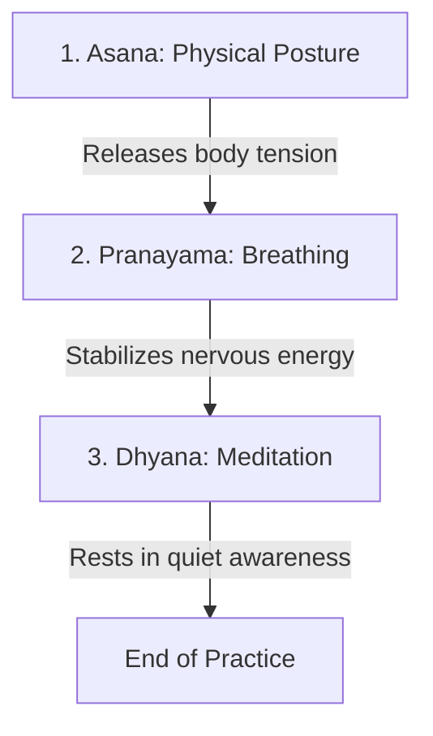

# Sadhana Routine Definitions & Custom Matching Rules

This document explains how daily routines are defined, structured, and personalized for users. 

---

## 1. Daily Sanctuary Sequence Structure

Every daily Sadhana is a **3-part sequence** executed in a specific, traditional order. This progression prepares the physical body, regulates the breath energy, and culminates in deep mental stillness:

1. **Asana (10 - 25 minutes)**: Gentle stretches or active flows to release physical blocks, improve flexibility, and prepare the physical body for sitting still.
2. **Pranayama (5 - 8 minutes)**: Breath control exercises to balance energetic pathways (Nadis), lower stress, and steady the nervous system.
3. **Dhyana (8 - 15 minutes)**: Meditation and mindfulness practices to settle the mind and connect with inner silence.

---

## 2. Tier Levels & Routine Distribution

The app distributes routines differently based on the user's subscription tier:

### 🌟 Free Tier (Global Daily Sadhana)
* **Goal**: Provides a standard, high-quality daily practice sequence suitable for all users.
* **Routine**: A fixed 7-day fallback routine. Every user on the free tier practices the exact same daily sequence depending on the day of the week (Monday through Sunday).
* **Control**: Defined in the database where `user_id` is blank (null).

### 💎 Premium Tier (Tailored Daily Sadhana)
* **Goal**: Delivers a custom-made sequence that targets the user's individual body tightness, experience level, and wellness goals.
* **Routine**: A unique 7-day plan dynamically generated for their specific profile upon finishing the onboarding questionnaire.
* **Control**: Re-calculated and written directly under the user's account in the database.

---

## 3. The Personalization Matching Logic

When a premium user completes the onboarding questions, the system runs an automated matching and rotation algorithm using three tags:

### Step A: Experience Level Filter
* **Asana**: POSTURES must match the user's experience level exactly (`beginner`, `intermediate`, or `advanced`) to avoid injury and keep practice engaging.
* **Pranayama & Dhyana**: BREATHING and MEDITATION exercises can match the user's level OR fall back to the `beginner` level (since basic breathwork and quiet sitting are safe and beneficial for all levels).

### Step B: Body Tightness Match (Asanas)
* Postures are filtered by matching the user's selected body tightness focuses (such as `hips`, `hamstrings`, `lower_back`, or `shoulders`). Postures that address these specific tight zones are prioritized.

### Step C: Wellness Goals Match (Pranayama & Dhyana)
* Breathing and meditation techniques are filtered by matching the user's wellness goals (such as `stress`, `mobility`, `focus`, `energy`, or `sleep`).

### Step D: The 7-Day Rotation Pattern
If multiple routines match the criteria, they are rotated across the 7 days of the week (Monday = Day 1, Sunday = Day 7) to keep the practice diverse and balanced:
* **Asana Selection**: `Day Posture = Matched Postures [ (Day Index % Total Matched Postures) ]`
* **Pranayama Selection**: `Day Breath = Matched Breaths [ (Day Index % Total Matched Breaths) ]`
* **Dhyana Selection**: `Day Meditation = Matched Meditations [ (Day Index % Total Matched Meditations) ]`

> [!TIP]
> This automatic rotation ensures that if a user has 3 matching Asana flows, they will practice Flow A on Day 1, Flow B on Day 2, Flow C on Day 3, Flow A on Day 4, and so forth, keeping their daily sanctuary fresh and comprehensive.
