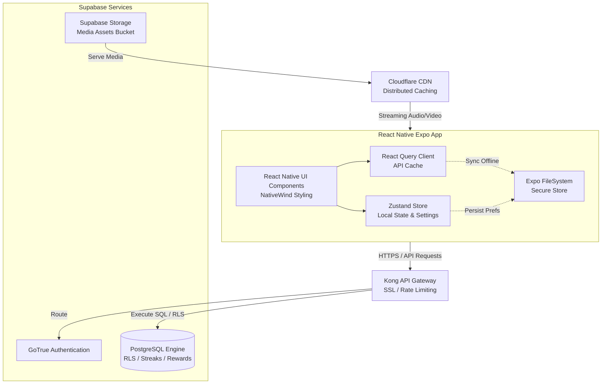
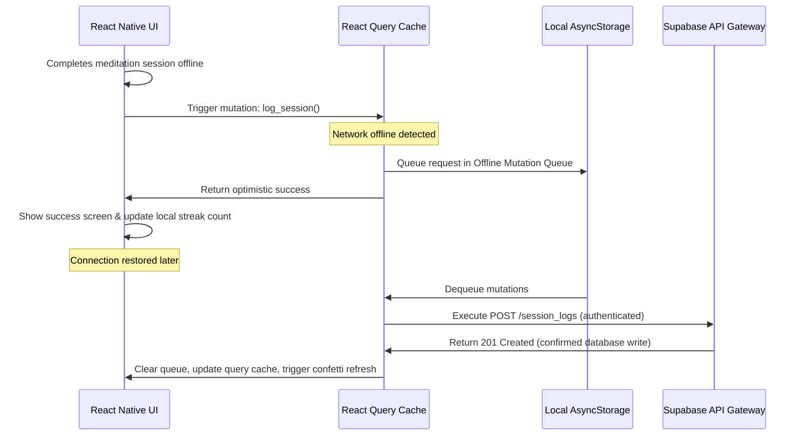

# System Architecture Specification — Sadhana

This document defines the high-level architecture layout, structural layers, data synchronization flows, and security constraints for the **Sadhana** mobile application.

---

## 1. System Architecture Layout

The system utilizes a client-server structure where the Expo React Native app communicates directly with a managed serverless backend (Supabase) and a distributed content delivery network (CDN).

---

## 2. Dynamic Data Flows

### 2.1 Offline Data Synchronization Flow
Describes how the mobile app processes updates during network loss (e.g. while meditating in a forest or practicing in a remote area).

---

## 3. Infrastructure Components

### 3.1 Mobile Client Layer (Expo / React Native)
*   **Routing System:** `Expo Router` (file-based navigation stack).
*   **Media Controllers:**
    *   `expo-av` (handling native system audio streaming, lock screen background controls, and video frame integrations).
    *   `expo-file-system` (handling chunk downloads, caching storage directories, and verifying SHA hashes).
*   **Secure Tokens Store:** `expo-secure-store` accesses hardware-level Keychain/Keystore environments to store API keys and refresh tokens.
*   **General Caching:** `@react-native-async-storage/async-storage` serves as the persistence engine for Zustand and React Query cache client.

### 3.2 Gateway & Authentication Layer
*   **Gateway Proxy:** Kong Gateway handles ingress requests. It verifies JWT signatures, terminates SSL/TLS, and restricts requests per client IP to prevent brute-force attacks.
*   **Auth Provider:** Supabase GoTrue Auth handles registration and OAuth validation with Google/Apple servers, issuing standard JWT responses.

### 3.3 Relational Database Layer (PostgreSQL)
*   Managed Postgres database.
*   **Data Integrity:** Foreign Keys with explicit `ON DELETE CASCADE` or `ON DELETE SET NULL` constraints to prevent orphan data records.
*   **Database Automation:** PL/pgSQL database triggers calculate streaks on log submissions, checking milestone views and updating wallet balances on ad updates (no business calculations are performed client-side).

### 3.4 Media Distribution Layer (CDN & Buckets)
*   **Media Storage:** S3-compatible Supabase Storage bucket stores master audio file formats (.mp3) and compressed video formats (.mp4).
*   **Distribution CDN:** Cloudflare caches files at the edge, reducing latency and buffer times for media playback in international regions.

---

## 4. Security & Compliance Strategy

### 4.1 Row-Level Security (RLS)
The database enforces strict client isolation at the storage engine level. No query can bypass RLS constraints:
*   Queries calling `profiles`, `session_logs`, `user_streaks`, etc., are scoped to `auth.uid() = user_id`.
*   A compromised API endpoint cannot return data from multiple users, mitigating OWASP API Top 10 vulnerabilities (e.g., Broken Object Level Authorization).

### 4.2 Data Sanitization & Input Checks
*   **Schema Enforcement:** PostgREST automatically verifies types, lengths, and constraints.
*   **SQL Injection Prevention:** Parametrized SQL queries are used throughout. Client APIs communicate with SQL tables via ORM/PostgREST layers, converting variables to strict SQL parameters.

### 4.3 GDPR/CCPA Compliance
*   **Consent Gate:** A dedicated consent prompt is displayed for EU users before tracking analytics or notifications are activated.
*   **Right to be Forgotten (Account Deletion):** Users can tap "Delete Account" in Settings. This calls `rpc/delete_user_account` which deletes the user's primary auth record. Cascade constraints automatically delete profiles, session history logs, questionnaire answers, streaks, and coin wallets.
*   **Right of Access (Data Export):** User data is returned as a structured JSON object upon request from the GDPR dashboard, mapping table records (logs, onboarding, profiles) into an exportable file format.
