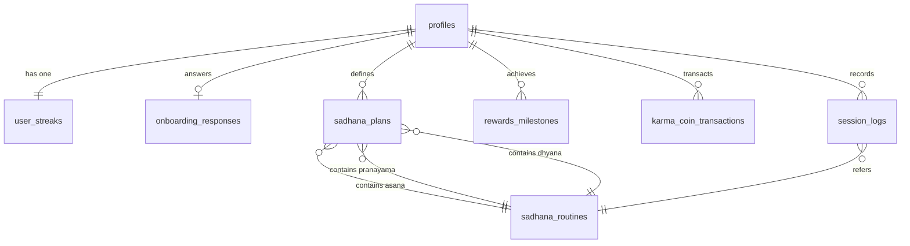

# Database Schema Spec — Sadhana

This document defines the relational database schema, database indexes, Row-Level Security (RLS) policies, and automation triggers for the **Sadhana** mobile backend, built on PostgreSQL (Supabase).

---

## 1. Entity Relationship Diagram (ERD)



---

## 2. Data Dictionary & Table Schemas

### 2.1 `profiles`
Holds general user data linked directly to the Supabase security table (`auth.users`).

| Column | Type | Constraints | Default | Description |
| :--- | :--- | :--- | :--- | :--- |
| `id` | `uuid` | PRIMARY KEY, FK -> `auth.users(id)` ON DELETE CASCADE | — | Unique user identifier |
| `username` | `varchar(100)` | — | `NULL` | User's display name |
| `avatar_url` | `text` | — | `NULL` | Link to profile picture |
| `premium` | `boolean` | `NOT NULL` | `false` | Subscription tier indicator |
| `monthly_ad_count` | `integer` | `NOT NULL`, `>= 0` | `0` | Running count of ads viewed this calendar month |
| `karma_coins` | `integer` | `NOT NULL`, `>= 0` | `0` | Points wallet balance (Premium only) |
| `last_ad_reset` | `timestamptz` | `NOT NULL` | `now()` | Timestamp of last monthly ad count reset |
| `created_at` | `timestamptz` | `NOT NULL` | `now()` | Profile creation timestamp |
| `updated_at` | `timestamptz` | `NOT NULL` | `now()` | Last modification timestamp |

*   **Indexes:**
    *   No custom index needed (Primary Key is automatically indexed).

---

### 2.2 `onboarding_responses`
Stores responses gathered during the personalization questionnaire.

| Column | Type | Constraints | Default | Description |
| :--- | :--- | :--- | :--- | :--- |
| `id` | `uuid` | PRIMARY KEY | `gen_random_uuid()` | Unique identifier |
| `user_id` | `uuid` | UNIQUE, FK -> `profiles(id)` ON DELETE CASCADE | — | Reference to user profile |
| `goals` | `text[]` | `NOT NULL` | — | Array of goals (e.g. `['stress', 'mobility']`) |
| `tightness` | `text[]` | `NOT NULL` | — | Focus areas (e.g. `['neck', 'hips']`) |
| `experience_level` | `varchar(20)` | `NOT NULL` | — | `beginner`, `intermediate`, or `advanced` |
| `habit_anchor` | `text` | `NOT NULL` | — | Daily trigger cue (e.g. "After brushing teeth") |
| `created_at` | `timestamptz` | `NOT NULL` | `now()` | Record timestamp |
| `updated_at` | `timestamptz` | `NOT NULL` | `now()` | Last update timestamp |

*   **Indexes:**
    *   `idx_onboarding_user_id`: B-Tree index on `user_id` for fast user profile lookup.

---

### 2.3 `sadhana_routines`
Holds single wellness sessions.

| Column | Type | Constraints | Default | Description |
| :--- | :--- | :--- | :--- | :--- |
| `id` | `uuid` | PRIMARY KEY | `gen_random_uuid()` | Unique session identifier |
| `title` | `varchar(150)` | `NOT NULL` | — | Session display name |
| `description` | `text` | `NOT NULL` | — | Session description and details |
| `duration_minutes` | `integer` | `NOT NULL`, `> 0` | — | Duration of media file |
| `category` | `varchar(30)` | `NOT NULL` | — | Type of session (`asana`, `pranayama`, `dhyana`, `philosophy`) |
| `is_premium` | `boolean` | `NOT NULL` | `false` | True if locked behind subscription paywall |
| `thumbnail_url` | `text` | `NOT NULL` | — | Image thumbnail path in S3/Storage CDN |
| `media_url` | `text` | `NOT NULL` | — | Audio or video stream path in S3/Storage CDN |
| `sanskrit_terms` | `jsonb` | — | `'{}'::jsonb` | Key-value list of Sanskrit terms with translations |
| `created_at` | `timestamptz` | `NOT NULL` | `now()` | Record creation timestamp |

*   **Indexes:**
    *   `idx_routines_category_premium`: Composite B-Tree index on `(category, is_premium)` for fast filters on search and browsing tabs.

---

### 2.4 `sadhana_plans`
Defines daily structured schedules (combinations of Asana, Pranayama, and Dhyana sessions).

| Column | Type | Constraints | Default | Description |
| :--- | :--- | :--- | :--- | :--- |
| `id` | `uuid` | PRIMARY KEY | `gen_random_uuid()` | Plan identifier |
| `user_id` | `uuid` | FK -> `profiles(id)` ON DELETE CASCADE | `NULL` | User owner (`NULL` indicates the static "Global Plan of the Day") |
| `asana_routine_id` | `uuid` | FK -> `sadhana_routines(id)` ON DELETE SET NULL | `NULL` | Selected Asana routine |
| `pranayama_routine_id`| `uuid` | FK -> `sadhana_routines(id)` ON DELETE SET NULL | `NULL` | Selected Pranayama routine |
| `dhyana_routine_id` | `uuid` | FK -> `sadhana_routines(id)` ON DELETE SET NULL | `NULL` | Selected Dhyana routine |
| `day_of_week` | `integer` | `NOT NULL`, check `day_of_week BETWEEN 0 AND 6` | — | Day index (0 = Sunday, 6 = Saturday) |
| `created_at` | `timestamptz` | `NOT NULL` | `now()` | Creation timestamp |

*   **Constraints:**
    *   `unique_user_day`: Unique constraint on `(user_id, day_of_week)` to prevent multiple custom plans per day for the same user.
*   **Indexes:**
    *   `idx_plans_user_day`: Composite index on `(user_id, day_of_week)` for fast fetching of current daily plans.

---

### 2.5 `session_logs`
Logs completed routines to calculate streaks and active days.

| Column | Type | Constraints | Default | Description |
| :--- | :--- | :--- | :--- | :--- |
| `id` | `uuid` | PRIMARY KEY | `gen_random_uuid()` | Log identifier |
| `user_id` | `uuid` | `NOT NULL`, FK -> `profiles(id)` ON DELETE CASCADE | — | User who completed the session |
| `routine_id` | `uuid` | FK -> `sadhana_routines(id)` ON DELETE SET NULL | `NULL` | Completed routine |
| `completed_at` | `timestamptz` | `NOT NULL` | `now()` | Time of completion |
| `duration_practiced` | `integer` | `NOT NULL`, `> 0` | — | Actual minutes practiced |

*   **Indexes:**
    *   `idx_logs_user_date`: Composite index on `(user_id, completed_at)` to support fast calendar queries and streak evaluations.

---

### 2.6 `user_streaks`
Maintains daily streak statistics for easy rendering.

| Column | Type | Constraints | Default | Description |
| :--- | :--- | :--- | :--- | :--- |
| `id` | `uuid` | PRIMARY KEY | `gen_random_uuid()` | Streak record identifier |
| `user_id` | `uuid` | UNIQUE, FK -> `profiles(id)` ON DELETE CASCADE | — | User profile relation |
| `current_streak` | `integer` | `NOT NULL`, `>= 0` | `0` | Current consecutive active days |
| `longest_streak` | `integer` | `NOT NULL`, `>= 0` | `0` | Max streak historically recorded |
| `last_completed_date` | `date` | — | `NULL` | Date of user's last session completion (UTC/local boundary) |
| `updated_at` | `timestamptz` | `NOT NULL` | `now()` | Last record modification timestamp |

---

### 2.7 `rewards_milestones`
Records reward milestones reached via monthly ad views.

| Column | Type | Constraints | Default | Description |
| :--- | :--- | :--- | :--- | :--- |
| `id` | `uuid` | PRIMARY KEY | `gen_random_uuid()` | Milestone record identifier |
| `user_id` | `uuid` | `NOT NULL`, FK -> `profiles(id)` ON DELETE CASCADE | — | User relation |
| `milestone_tier` | `integer` | `NOT NULL`, check `milestone_tier IN (1, 2, 3)` | — | 1 (10 ads), 2 (30 ads), or 3 (50 ads) |
| `unlocked_at` | `timestamptz` | `NOT NULL` | `now()` | Unlock timestamp |
| `reward_type` | `varchar(30)` | `NOT NULL` | — | Unlocked item description |
| `claimed` | `boolean` | `NOT NULL` | `false` | True if the user has claimed the benefit |

*   **Constraints:**
    *   `unique_user_month_tier`: Composite constraint preventing duplicate reward records for the same tier in a given reset period.

---

### 2.8 `karma_coin_transactions`
Logs coin ledger transactions (Premium only).

| Column | Type | Constraints | Default | Description |
| :--- | :--- | :--- | :--- | :--- |
| `id` | `uuid` | PRIMARY KEY | `gen_random_uuid()` | Transaction identifier |
| `user_id` | `uuid` | `NOT NULL`, FK -> `profiles(id)` ON DELETE CASCADE | — | User wallet relation |
| `amount` | `integer` | `NOT NULL` | — | Amount (positive for earnings, negative for redemptions) |
| `transaction_type` | `varchar(30)` | `NOT NULL` | — | `earn_ad`, `redeem_discount`, `redeem_donation` |
| `description` | `text` | `NOT NULL` | — | Detail (e.g. "Donated to rural health clinic") |
| `created_at` | `timestamptz` | `NOT NULL` | `now()` | Transaction date |

---

## 3. Row-Level Security (RLS) Policies

All tables are protected by Row-Level Security (RLS). The policies utilize `auth.uid()` to map user context.

```sql
-- Enable RLS on all tables
ALTER TABLE profiles ENABLE ROW LEVEL SECURITY;
ALTER TABLE onboarding_responses ENABLE ROW LEVEL SECURITY;
ALTER TABLE sadhana_plans ENABLE ROW LEVEL SECURITY;
ALTER TABLE session_logs ENABLE ROW LEVEL SECURITY;
ALTER TABLE user_streaks ENABLE ROW LEVEL SECURITY;
ALTER TABLE rewards_milestones ENABLE ROW LEVEL SECURITY;
ALTER TABLE karma_coin_transactions ENABLE ROW LEVEL SECURITY;
ALTER TABLE sadhana_routines ENABLE ROW LEVEL SECURITY;

-- 1. profiles Policies
CREATE POLICY "Allow users to read own profile" ON profiles 
    FOR SELECT USING (auth.uid() = id);

CREATE POLICY "Allow users to update own profile fields" ON profiles 
    FOR UPDATE USING (auth.uid() = id) 
    WITH CHECK (auth.uid() = id);

-- 2. onboarding_responses Policies
CREATE POLICY "Allow users to manage own onboarding responses" ON onboarding_responses 
    FOR ALL USING (auth.uid() = user_id) 
    WITH CHECK (auth.uid() = user_id);

-- 3. sadhana_plans Policies
CREATE POLICY "Allow read for owned plans or global plans" ON sadhana_plans 
    FOR SELECT USING (auth.uid() = user_id OR user_id IS NULL);

CREATE POLICY "Allow users to modify owned plans" ON sadhana_plans 
    FOR ALL USING (auth.uid() = user_id) 
    WITH CHECK (auth.uid() = user_id);

-- 4. session_logs Policies
CREATE POLICY "Allow users to manage own session logs" ON session_logs 
    FOR ALL USING (auth.uid() = user_id) 
    WITH CHECK (auth.uid() = user_id);

-- 5. user_streaks Policies
CREATE POLICY "Allow users to read own streak" ON user_streaks 
    FOR SELECT USING (auth.uid() = user_id);

-- 6. rewards_milestones Policies
CREATE POLICY "Allow users to manage own rewards milestones" ON rewards_milestones 
    FOR ALL USING (auth.uid() = user_id) 
    WITH CHECK (auth.uid() = user_id);

-- 7. karma_coin_transactions Policies
CREATE POLICY "Allow users to read own transaction history" ON karma_coin_transactions 
    FOR SELECT USING (auth.uid() = user_id);

-- 8. sadhana_routines Policies (Global catalog)
CREATE POLICY "Allow authenticated or guest users to read all routines" ON sadhana_routines 
    FOR SELECT USING (true);
```

---

## 4. PostgreSQL Triggers & Automation Functions

To keep database calculations off client environments and secure them server-side, the following PL/pgSQL routines are configured:

### 4.1 Auto-Create Profile on Signup
Listens to `auth.users` additions and replicates profiles automatically.

```sql
CREATE OR REPLACE FUNCTION public.handle_new_user()
RETURNS TRIGGER AS $$
BEGIN
    INSERT INTO public.profiles (id, username, avatar_url, premium)
    VALUES (
        new.id,
        COALESCE(new.raw_user_meta_data->>'username', 'Sadhaka'),
        new.raw_user_meta_data->>'avatar_url',
        false
    );
    
    INSERT INTO public.user_streaks (user_id, current_streak, longest_streak)
    VALUES (new.id, 0, 0);
    
    RETURN NEW;
END;
$$ LANGUAGE plpgsql SECURITY DEFINER;

CREATE TRIGGER on_auth_user_created
    AFTER INSERT ON auth.users
    FOR EACH ROW EXECUTE FUNCTION public.handle_new_user();
```

### 4.2 Automated Streak Calculation
Listens to `session_logs` insertions, verifying days and updating streaks.

```sql
CREATE OR REPLACE FUNCTION public.update_user_streak()
RETURNS TRIGGER AS $$
DECLARE
    today DATE;
    yesterday DATE;
    last_date DATE;
    streak_count INTEGER;
    max_streak INTEGER;
BEGIN
    -- Extract timezone-adjusted date from user insertion
    today := (NEW.completed_at AT TIME ZONE 'UTC')::DATE;
    yesterday := today - INTERVAL '1 day';
    
    -- Fetch current streak record
    SELECT last_completed_date, current_streak, longest_streak 
    INTO last_date, streak_count, max_streak
    FROM public.user_streaks
    WHERE user_id = NEW.user_id;
    
    IF last_date IS NULL THEN
        -- First session ever
        streak_count := 1;
        max_streak := GREATEST(max_streak, streak_count);
    ELSIF last_date = today THEN
        -- Already completed a session today, no streak increment
        RETURN NEW;
    ELSIF last_date = yesterday THEN
        -- Completed yesterday, increment streak
        streak_count := streak_count + 1;
        max_streak := GREATEST(max_streak, streak_count);
    ELSE
        -- Streak broken
        streak_count := 1;
    END IF;
    
    -- Update streak values
    UPDATE public.user_streaks
    SET current_streak = streak_count,
        longest_streak = max_streak,
        last_completed_date = today,
        updated_at = now()
    WHERE user_id = NEW.user_id;
    
    RETURN NEW;
END;
$$ LANGUAGE plpgsql SECURITY DEFINER;

CREATE TRIGGER on_session_completed
    AFTER INSERT ON public.session_logs
    FOR EACH ROW EXECUTE FUNCTION public.update_user_streak();
```
