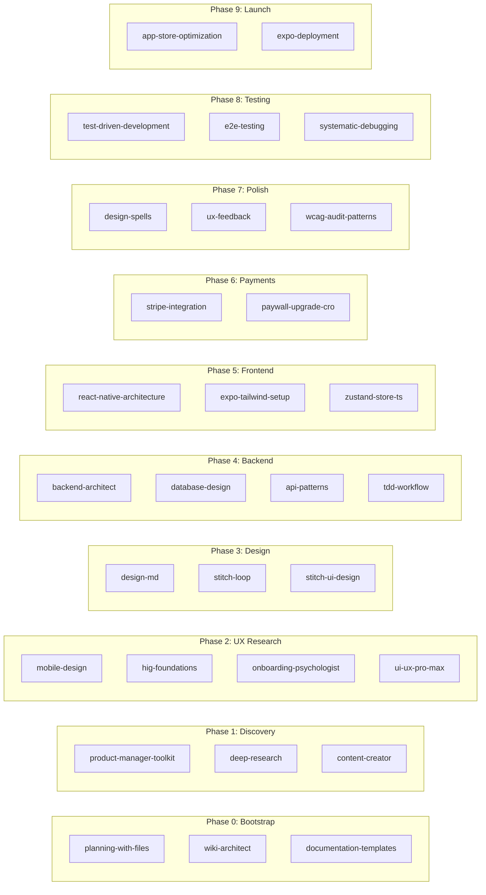

# Agentic Development Playbook: Sadhana

> **For Agents:** This is the master blueprint. Before touching ANY code, read this file end-to-end.
> **Skill:** `writing-plans` → Structure. `planning-with-files` → Persistence. `wiki-architect` → Documentation. `documentation-templates` → Standards.

**Goal:** Build a top-tier, production-ready mobile application entirely within the Antigravity agentic environment — from market research through cross-platform deployment on both Apple App Store and Google Play Store — using autonomous agents, human-in-the-loop gates, and a premium design-first philosophy.

**Architecture:** A 10-phase waterfall-with-feedback-loops approach. Each phase produces mandatory documentation artifacts that gate entry to the next phase. Agents operate via `subagent-driven-development` with two-stage review (spec compliance → code quality). All context is persisted to disk following the `planning-with-files` pattern to survive context window resets.

**Environment:** Google Antigravity Agentic IDE (Windows). All code, docs, and orchestration happen inside this environment.
**Project Root:** `D:\Desktop\Fitness`

---

## Table of Contents

1. [Master Agent Prompt](#1-master-agent-prompt)
2. [Documentation Architecture](#2-documentation-architecture)
3. [Persistent Working Memory](#3-persistent-working-memory)
4. [Phase 0: Project Bootstrap](#phase-0-project-bootstrap)
5. [Phase 1: Discovery & Product Strategy](#phase-1-discovery--product-strategy)
6. [Phase 2: UX Research & Information Architecture](#phase-2-ux-research--information-architecture)
7. [Phase 3: Design System & UI Generation](#phase-3-design-system--ui-generation)
8. [Phase 4: Architecture & Backend](#phase-4-architecture--backend)
9. [Phase 5: Frontend Build & Integration](#phase-5-frontend-build--integration)
10. [Phase 6: Monetization & Payments](#phase-6-monetization--payments)
11. [Phase 7: UX Polish & Micro-Interactions](#phase-7-ux-polish--micro-interactions)
12. [Phase 8: Testing & QA](#phase-8-testing--qa)
13. [Phase 9: Deployment & Launch](#phase-9-deployment--launch)
14. [Phase 10: Post-Launch & Iteration](#phase-10-post-launch--iteration)
15. [Cross-Cutting Concerns](#cross-cutting-concerns)
16. [Error & Escalation Protocol](#error--escalation-protocol)
17. [Skill Reference Index](#skill-reference-index)

---

## 1. Master Agent Prompt

*Every new agent, subagent, or session MUST be initialized with this prompt:*

```text
Act as an elite Senior Mobile Architect and Product Designer at a top-tier agency.
You are building the premium mobile application "Sadhana" in the Antigravity agentic environment.

BEFORE writing any code or making design decisions, you MUST:
1. Read `docs/playbook/00_MASTER_PLAYBOOK.md` — understand the current phase.
2. Read `docs/PRODUCT_REQUIREMENTS.md` — understand business context and feature scope.
3. Read `docs/design/DESIGN_SYSTEM.md` — follow strict UI/UX constraints.
4. Read `docs/PLATFORM_RULES.md` — follow iOS (Apple HIG) and Android (Material 3) rules.
5. Read `task_plan.md` — understand what task you're executing and its current status.
6. Read `findings.md` — understand what has been discovered and decided so far.

Your code and design must be:
- 100% Complete & Production-Ready: ZERO tolerance for AI-slop code. Never write placeholder comments like "// TODO" or "// Implement later". Every function, file, and styling rule must be fully implemented and strictly typed (TypeScript strict mode).
- Premium & Rich Aesthetics: NO generic AI layouts or default browser colors. Every screen must wow the user immediately. Use harmoniously curated color palettes, elegant custom typography, and fluid micro-animations. Consult the `design-spells` and `frontend-design` skills constantly.
- Audited & Robust: Run the `vibe-code-auditor` skill on all generated code to scan for fragility, structural issues, or performance blockages. All logic must be heavily tested (TDD: red → green → refactor).
- Optimized: Guarantee 60fps performance for animations, quick page loads, and smooth state updates.

Never bypass the testing phase. Never ship placeholder UI.
When blocked or if requirements are ambiguous, STOP and escalate immediately — NO guesswork. Consult the `ask-questions-if-underspecified` skill.
```

---

## 2. Documentation Architecture

> **IMPORTANT:** These files form the **documentation spine** of the project. Each document has a specific phase where it MUST be created. **No code is written until the Phase 0–2 documents exist.**

### Document Registry

| # | Document | Path | Created In | Purpose | Primary Skill |
|---|----------|------|-----------|---------|---------------|
| 1 | Master Playbook | `docs/playbook/00_MASTER_PLAYBOOK.md` | Phase 0 | This file — master blueprint | `writing-plans` |
| 2 | Doc Index | `docs/playbook/01_DOCUMENT_INDEX.md` | Phase 0 | Wiki-style catalogue of all docs | `wiki-architect` |
| 3 | Skill Quick-Ref | `docs/playbook/02_SKILL_QUICKREF.md` | Phase 0 | When-to-use cheatsheet for all skills | `documentation-templates` |
| 4 | Product Requirements | `docs/PRODUCT_REQUIREMENTS.md` | Phase 1 | App concept, audience, features, monetization | `product-manager-toolkit` |
| 5 | Competitive Analysis | `docs/research/COMPETITIVE_ANALYSIS.md` | Phase 1 | Competitor teardowns, market gaps | `deep-research` |
| 6 | Brand & Naming | `docs/research/BRAND_NAMING.md` | Phase 1 | App name, tagline, positioning | `content-creator` |
| 7 | User Personas | `docs/ux/USER_PERSONAS.md` | Phase 2 | Target users with goals, pain points | `mobile-design` |
| 8 | User Flows | `docs/ux/USER_FLOWS.md` | Phase 2 | Mermaid flow diagrams for key journeys | `ui-ux-pro-max` |
| 9 | Onboarding Logic | `docs/ux/ONBOARDING_STRATEGY.md` | Phase 2 | Progressive disclosure, permission priming | `onboarding-psychologist` |
| 10 | Design System | `docs/design/DESIGN_SYSTEM.md` | Phase 3 | Colors, typography, spacing, components | `design-md` |
| 11 | Platform Rules | `docs/PLATFORM_RULES.md` | Phase 3 | iOS HIG + Android Material 3 rules | `hig-foundations` |
| 12 | Stitch Site Map | `.stitch/SITE.md` | Phase 3 | Screen inventory and navigation structure | `stitch-ui-design` |
| 13 | Stitch Design | `.stitch/DESIGN.md` | Phase 3 | Visual style for Stitch generation | `design-md` |
| 14 | Architecture Overview | `docs/architecture/ARCHITECTURE.md` | Phase 4 | Tech stack, schema, API surface | `backend-architect` |
| 15 | API Specification | `docs/architecture/API_SPEC.md` | Phase 4 | Endpoint contracts (OpenAPI style) | `api-patterns` |
| 16 | Database Schema | `docs/architecture/DATABASE_SCHEMA.md` | Phase 4 | ERD, tables, relationships, indexes | `database-design` |
| 17 | ADR Directory | `docs/architecture/ADR/` | Phase 4 | Key technical decisions (ADR format) | `documentation-templates` |
| 18 | Testing Strategy | `docs/TESTING_STRATEGY.md` | Phase 8 | E2E, unit, integration protocols | `tdd-workflow` |
| 19 | Deployment Runbook | `docs/DEPLOYMENT_RUNBOOK.md` | Phase 9 | Step-by-step release process | `expo-deployment` |
| 20 | Store Listing Assets | `docs/launch/STORE_ASSETS.md` | Phase 9 | Screenshots, descriptions, keywords for Apple App Store & Google Play Store | `app-store-optimization` |
| 21 | Changelog | `CHANGELOG.md` | Phase 9 | Keep-a-Changelog format | `documentation-templates` |
| 22 | README | `README.md` | Phase 9 | Project overview for devs | `documentation-templates` |

### Architecture Decision Records (ADRs)

> Use `documentation-templates` skill → ADR template for every non-trivial technical decision.

```
docs/architecture/ADR/
├── ADR-001-tech-stack-selection.md
├── ADR-002-auth-strategy.md
├── ADR-003-state-management.md
├── ADR-004-navigation-pattern.md
└── ADR-005-payment-provider.md
```

Each ADR follows this format:
```markdown
# ADR-NNN: [Title]
## Status: Proposed | Accepted | Deprecated | Superseded
## Context: Why are we making this decision?
## Decision: What did we decide?
## Consequences: What are the trade-offs?
```

---

## 3. Persistent Working Memory

> **TIP:** `planning-with-files` — Treat the filesystem as persistent RAM. These three files are your lifeline across context window resets.

```
Context Window = RAM (volatile, limited)
Filesystem    = Disk (persistent, unlimited)
→ Anything important gets written to disk.
```

### Working Memory Files (Project Root)

| File | Purpose | Update Frequency |
|------|---------|-----------------|
| `task_plan.md` | Current phase, tasks, status, decisions | After every phase transition |
| `findings.md` | Research discoveries, competitor notes, design decisions | After ANY discovery (2-action rule) |
| `progress.md` | Session log, test results, errors encountered | Throughout every session |

### The 2-Action Rule
> "After every 2 view/browser/search operations, IMMEDIATELY save key findings to `findings.md`."

This prevents visual/multimodal information from being lost when context scrolls away.

### The 5-Question Reboot Test
Before resuming work after any break or context reset:

| Question | Answer Source |
|----------|--------------|
| Where am I? | Current phase in `task_plan.md` |
| Where am I going? | Remaining phases in this playbook |
| What's the goal? | `docs/PRODUCT_REQUIREMENTS.md` |
| What have I learned? | `findings.md` |
| What have I done? | `progress.md` |

### Read vs Write Decision Matrix

| Situation | Action | Reason |
|-----------|--------|--------|
| Just wrote a file | DON'T read | Content still in context |
| Viewed image/PDF | Write findings NOW | Multimodal → text before lost |
| Browser returned data | Write to file | Screenshots don't persist |
| Starting new phase | Read plan/findings | Re-orient if context stale |
| Error occurred | Read relevant file | Need current state to fix |
| Resuming after gap | Read all planning files | Recover state |

### 3-Strike Error Protocol

```
ATTEMPT 1: Diagnose & Fix
  → Read error carefully
  → Identify root cause
  → Apply targeted fix

ATTEMPT 2: Alternative Approach
  → Same error? Try different method
  → Different tool? Different library?
  → NEVER repeat exact same failing action

ATTEMPT 3: Broader Rethink
  → Question assumptions
  → Search for solutions
  → Consider updating the plan

AFTER 3 FAILURES: Escalate to User
  → Explain what you tried
  → Share the specific error
  → Ask for guidance
```

---

## Phase 0: Project Bootstrap

> **Goal:** Initialize project structure, playbook, and working memory files.
> **Gate:** This phase is complete when the directory scaffold and working memory files exist.

### Actions
1. Create project directory scaffold (see structure below)
2. Create this playbook (`00_MASTER_PLAYBOOK.md`)
3. Create document index (`01_DOCUMENT_INDEX.md`) using `wiki-architect`
4. Create skill quick-reference (`02_SKILL_QUICKREF.md`)
5. Initialize `task_plan.md`, `findings.md`, `progress.md` in project root
6. Initialize `llms.txt` for AI-friendly project context using `documentation-templates`

### Skills Invoked
| Skill | Why |
|-------|-----|
| `planning-with-files` | Initialize persistent working memory files |
| `wiki-architect` | Create hierarchical documentation catalogue |
| `documentation-templates` | `llms.txt`, README scaffold, ADR template |
| `writing-plans` | Structure the playbook itself |

### Directory Scaffold

```
project-root/
├── docs/
│   ├── playbook/
│   │   ├── 00_MASTER_PLAYBOOK.md        ← This file
│   │   ├── 01_DOCUMENT_INDEX.md         ← Wiki catalogue
│   │   └── 02_SKILL_QUICKREF.md         ← Skill cheatsheet
│   ├── research/
│   │   ├── COMPETITIVE_ANALYSIS.md      ← Phase 1
│   │   └── BRAND_NAMING.md              ← Phase 1
│   ├── ux/
│   │   ├── USER_PERSONAS.md             ← Phase 2
│   │   ├── USER_FLOWS.md                ← Phase 2
│   │   └── ONBOARDING_STRATEGY.md       ← Phase 2
│   ├── design/
│   │   └── DESIGN_SYSTEM.md             ← Phase 3
│   ├── architecture/
│   │   ├── ARCHITECTURE.md              ← Phase 4
│   │   ├── API_SPEC.md                  ← Phase 4
│   │   ├── DATABASE_SCHEMA.md           ← Phase 4
│   │   └── ADR/                         ← Phase 4
│   ├── launch/
│   │   └── STORE_ASSETS.md              ← Phase 9
│   ├── PRODUCT_REQUIREMENTS.md          ← Phase 1
│   ├── PLATFORM_RULES.md               ← Phase 3
│   ├── TESTING_STRATEGY.md              ← Phase 8
│   └── DEPLOYMENT_RUNBOOK.md            ← Phase 9
├── .stitch/
│   ├── DESIGN.md                        ← Phase 3
│   └── SITE.md                          ← Phase 3
├── src/                                 ← Phase 5 (created during project init)
├── task_plan.md                         ← Working memory
├── findings.md                          ← Working memory
├── progress.md                          ← Working memory
├── llms.txt                             ← AI context file
├── CHANGELOG.md                         ← Phase 9
└── README.md                            ← Phase 9
```

### Entry Criteria
- None (this is the starting phase)

### Exit Criteria
- [ ] All directories created
- [ ] Working memory files initialized with templates
- [ ] Playbook, doc index, and skill quick-ref written
- [ ] `llms.txt` initialized
- [ ] User has reviewed and approved the playbook structure

---

## Phase 1: Discovery & Product Strategy

> **Goal:** Define WHAT we're building, for WHOM, and WHY it will win.
> **Gate:** `docs/PRODUCT_REQUIREMENTS.md` approved by user.

### Actions
1. **Answer open questions** (see below) — use `ask-questions-if-underspecified`
2. **Market research** — Analyze 3–5 direct competitors, identify market gaps — use `deep-research`
3. **App naming** — Generate 5+ name candidates, check availability — use `content-creator`
4. **Feature brainstorming** — MVP vs. V2 feature triage using MoSCoW prioritization
5. **Monetization modeling** — Define pricing tiers and revenue projections
6. **Write PRD** — Create `docs/PRODUCT_REQUIREMENTS.md` — use `product-manager-toolkit`
7. **Write competitive analysis** — Create `docs/research/COMPETITIVE_ANALYSIS.md`
8. **Write brand document** — Create `docs/research/BRAND_NAMING.md`

### Skills Invoked
| Skill | Why | When in Phase |
|-------|-----|---------------|
| `ask-questions-if-underspecified` | Clarify ambiguous requirements before committing | Step 1 |
| `deep-research` | Autonomous multi-step competitive research | Step 2 |
| `content-creator` | Brand voice, naming, tagline generation | Step 3 |
| `product-manager-toolkit` | PRD authoring, MoSCoW, market analysis frameworks | Steps 4–6 |
| `concise-planning` | Turn product vision into actionable scope | Step 5 |
| `planning-with-files` | Save all research findings to `findings.md` | Throughout |

### Open Questions

> **WARNING:** These questions MUST be answered to proceed to Phase 2.

1. **What is the core concept of the app?** (What problem does it solve? One sentence.)
2. **Who is the exact target audience?** (Demographics, psychographics, tech comfort level)
3. **What is your desired monetization strategy?** (Freemium, Subscription, Paid upfront, Ad-supported)
4. **What competitors do you admire or want to beat?** (Name 2–3 apps)
5. **What platform(s) are we targeting first?** (iOS-first, Android-first, or both simultaneously)
6. **What is the MVP deadline or timeline expectation?** (Weeks, months)
7. **Are there any hard technical constraints?** (Offline-first, specific APIs, compliance requirements like HIPAA/GDPR)

### Documents Created
- `docs/PRODUCT_REQUIREMENTS.md`
- `docs/research/COMPETITIVE_ANALYSIS.md`
- `docs/research/BRAND_NAMING.md`

### Exit Criteria
- [ ] All 7 open questions answered
- [ ] PRD written with MVP feature list and MoSCoW classification
- [ ] Competitive analysis with 3+ competitors analyzed
- [ ] App name selected and documented
- [ ] Monetization strategy defined
- [ ] User has approved PRD

---

## Phase 2: UX Research & Information Architecture

> **Goal:** Define WHO uses the app and HOW they navigate it, and finalize features and screen layouts before visual design.
> **Gate:** User flows, onboarding strategy, and Features & Screens document approved by user.

### Actions
1. **Create user personas** — 2–3 primary personas with goals, frustrations, scenarios
2. **Map user flows** — Mermaid diagrams for core journeys (onboarding, primary action, purchase)
3. **Design information architecture** — Screen inventory, navigation hierarchy
4. **Define onboarding strategy** — Progressive disclosure, permission priming, skip logic
5. **Write platform rules** — iOS (HIG) and Android (Material 3) specific UX constraints
6. **Create features and screens document** — Define `docs/ux/FEATURES_AND_SCREENS.md` containing the finalized feature list, screen descriptions, and specific prompts to feed to Google Stitch.

### Skills Invoked
| Skill | Why | When in Phase |
|-------|-----|---------------|
| `mobile-design` | Mobile-first, touch-first, platform-respectful principles | Steps 1–3 |
| `hig-foundations` | Apple Human Interface Guidelines design foundations | Step 5 |
| `hig-patterns` | Apple HIG interaction and UX patterns | Step 5 |
| `hig-platforms` | Platform-specific design considerations | Step 5 |
| `hig-components-layout` | Layout and navigation component guidelines | Step 3 |
| `onboarding-psychologist` | Conversion-optimized onboarding psychology | Step 4 |
| `onboarding-cro` | Conversion rate optimization for onboarding | Step 4 |
| `ui-ux-pro-max` | Premium UX flow design | Steps 2–3 |
| `jobs-to-be-done-analyst` | Understanding user motivations at a deep level | Step 1 |
| `customer-psychographic-profiler` | Deep psychographic user profiling | Step 1 |

### Documents Created
- `docs/ux/USER_PERSONAS.md`
- `docs/ux/USER_FLOWS.md`
- `docs/ux/ONBOARDING_STRATEGY.md`
- `docs/ux/FEATURES_AND_SCREENS.md`
- `docs/PLATFORM_RULES.md`

### Exit Criteria
- [ ] 2–3 personas with name, scenario, goals, frustrations
- [ ] Mermaid flow diagrams for: onboarding, primary action, purchase flow
- [ ] Complete screen inventory with navigation map
- [ ] Onboarding strategy with permission priming sequence
- [ ] Platform rules documented for both iOS and Android
- [ ] Features and Screens document (`FEATURES_AND_SCREENS.md`) created and approved by user
- [ ] User has approved UX direction

---

## Phase 3: Design System & UI Generation

> **Goal:** Create a visual identity, design screens in Google Stitch based on our sitemap, and pull down high-fidelity assets.
> **Gate:** Design system approved + Stitch screens designed by user and pulled down for all MVP flows.

### Actions
1. **Create design system** — Color palette (light + dark), typography scale, spacing tokens, elevation, border-radius, component spec
2. **Write Stitch config** — `.stitch/DESIGN.md` (visual style) and `.stitch/SITE.md` (screen map)
3. **User-Driven Design in Google Stitch** — User designs/edits screens in the Google Stitch editor using the sitemap and prompts defined in `docs/ux/FEATURES_AND_SCREENS.md`
4. **Pull Down Stitch screens** — Antigravity uses Stitch MCP tools (`get_project`, `get_screen`, etc.) to pull down HTML, CSS, and screenshots into the project directory
5. **Visual review & sync** — Verify pulled designs against the design system and update sitemap/metadata
6. Generate assets — iOS App Icon (1024×1024), Android Adaptive Icon layers (foreground + background), splash screens (including Android 12+ splash configuration), and marketing screenshots

### Master Google Stitch Prompt Template
Use this template as a structure for designing screens in Google Stitch. Copy the design styles from `.stitch/DESIGN.md` and the screen description from `docs/ux/FEATURES_AND_SCREENS.md` to customize it:

```text
Act as a world-class UI/UX designer. Design a premium, modern, and high-fidelity mobile screen for "Sadhana", an authentic Indian wellness platform. 

Target Device: Mobile (390px width, edge-to-edge layout, status bar safe area at the top and home indicator at the bottom).
Visual Style: [DESCRIBE THE THEME, COLOR PALETTE, CARD STYLE, TYPOGRAPHY, AND BASE GRID FROM .stitch/DESIGN.md]

Screen to Design: [INSERT SCREEN NAME & KEY COMPONENTS FROM FEATURES_AND_SCREENS.md]
- Header: [e.g., logo, search, location bar]
- Body: [e.g., list of cards, forms, sliders]
- Navigation: [e.g., tab bar, stack navigation controller]
- Content details: [e.g., text, labels, badges, interactive elements]
```

### Skills Invoked
| Skill | Why | When in Phase |
|-------|-----|---------------|
| `design-md` | Synthesize semantic design system into DESIGN.md | Step 1 |
| `stitch-ui-design` | Stitch-specific UI design patterns and screen generation | Steps 2–3 |
| `frontend-design` | Premium visual design — not just layout generation | Step 1 |
| `design-spells` | Micro-interactions and "magic" details for premium feel | Step 5 |
| `iconsax-library` | Extensive icon selection for premium UI | Step 3 |
| `unsplash-integration` | High-quality free photography for placeholder content | Step 3 |
| `generate_image` (tool) | App icon, splash screen, marketing assets | Step 6 |

### Documents Created
- `docs/design/DESIGN_SYSTEM.md`
- `.stitch/DESIGN.md`
- `.stitch/SITE.md`
- `.stitch/designs/` (pulled HTML, CSS, PNG files)

### Exit Criteria
- [ ] Design system with: colors (light + dark), typography scale, spacing tokens, elevation, border-radius, component specs
- [ ] Dark mode palette fully defined
- [ ] Stitch DESIGN.md and SITE.md written
- [ ] All MVP screens designed by user in Google Stitch and pulled down successfully to `.stitch/designs/`
- [ ] App icon generated (1024×1024 for iOS, and adaptive layers for Android)
- [ ] Splash screens generated (iOS storyboard & Android 12+ vector/color configuration)
- [ ] User has approved visual direction and pulled files

---

## Phase 4: Architecture & Backend

> **Goal:** Design the technical foundation and build the backend.
> **Gate:** Architecture doc approved + backend deployed + API tests passing.

### Actions
1. **Select tech stack** — Write ADR-001 (Tech Stack Selection)
2. **Design database schema** — ERD, tables, relationships, indexes, RLS policies
3. **Design API surface** — RESTful endpoints or GraphQL schema
4. **Select auth strategy** — Write ADR-002 (Auth Strategy)
5. **Select state management** — Write ADR-003 (State Management)
6. **Scaffold backend** — Initialize Supabase / Firebase / custom Node.js
7. **Implement auth** — Email/password, social login, session management
8. **Build core API endpoints** — CRUD for primary entities
9. **Write backend tests** — Unit + integration tests for all endpoints
10. **Deploy staging backend** — Accessible for frontend integration

### Skills Invoked
| Skill | Why | When in Phase |
|-------|-----|---------------|
| `backend-architect` | Scalable API design, architecture patterns | Steps 1–3 |
| `database-design` | Schema design, indexing strategy, ORM selection | Step 2 |
| `database-architect` | Cloud database architecture, reliability | Step 2 |
| `api-patterns` | REST vs GraphQL, pagination, response formats | Step 3 |
| `documentation-templates` | ADR format for architecture decisions | Steps 1, 4, 5 |
| `auth-implementation-patterns` | Secure auth flows | Steps 4, 7 |
| `secrets-management` | Secure secrets/env var handling | Step 6 |
| `tdd-workflow` | Red-green-refactor for backend logic | Steps 8–9 |
| `writing-plans` | Break backend build into bite-sized TDD tasks | Before Step 6 |

### Execution Model

> **Skill:** `subagent-driven-development` — Fresh subagent per backend task with two-stage review.

```
For each backend task:
1. Dispatch implementer subagent → implements + tests + commits
2. Dispatch spec reviewer subagent → confirms code matches API spec
3. Dispatch code quality reviewer → ensures production quality
4. Mark task complete in task_plan.md
```

### Documents Created
- `docs/architecture/ARCHITECTURE.md`
- `docs/architecture/API_SPEC.md`
- `docs/architecture/DATABASE_SCHEMA.md`
- `docs/architecture/ADR/ADR-001-tech-stack-selection.md`
- `docs/architecture/ADR/ADR-002-auth-strategy.md`
- `docs/architecture/ADR/ADR-003-state-management.md`

### Exit Criteria
- [ ] Architecture doc with system diagram (Mermaid)
- [ ] Database schema with ERD diagram
- [ ] API spec with all MVP endpoints documented
- [ ] All ADRs written and approved
- [ ] Auth flow working (signup, login, logout, token refresh)
- [ ] Core CRUD endpoints working with tests
- [ ] Backend deployed to staging
- [ ] All backend tests passing
- [ ] Secrets managed properly (no hardcoded keys)

---

## Phase 5: Frontend Build & Integration

> **Goal:** Build the mobile app frontend and wire it to the backend.
> **Gate:** All MVP screens functional with live data.

### Actions
1. **Initialize project** — Expo + React Native with TypeScript strict mode
2. **Set up navigation** — File-based routing (Expo Router) per screen inventory (ADR-004)
3. **Implement design system** — Translate tokens from `DESIGN_SYSTEM.md` into theme provider
4. **Build screen components** — Convert Stitch HTML/CSS to React Native components
5. **Wire state management** — Zustand + React Query for server state (per ADR-003)
6. **Integrate API layer** — Connect all screens to backend endpoints
7. **Implement offline support** — If required by PRD
8. **Implement deep linking** — Universal links / app links

### Skills Invoked
| Skill | Why | When in Phase |
|-------|-----|---------------|
| `react-native-architecture` | RN architectural patterns and best practices | Steps 1–2 |
| `expo-tailwind-setup` | Tailwind CSS v4 in Expo with NativeWind v5 | Step 3 |
| `react-patterns` | Modern hooks, composition, TypeScript patterns | Steps 3–5 |
| `zustand-store-ts` | Type-safe Zustand stores with middleware | Step 5 |
| `react-component-performance` | Diagnose slow components, targeted fixes | Step 4 |
| `subagent-driven-development` | Fresh subagent per screen/feature | Throughout |
| `tdd-workflow` | Red-green-refactor for component logic | Throughout |
| `writing-plans` | Break frontend build into per-screen tasks | Before Step 4 |

### Execution Model

> **Skill:** `subagent-driven-development` — Each screen is an independent task.

```
Screen: Onboarding → Subagent builds + tests + spec review + quality review
Screen: Home Feed  → Subagent builds + tests + spec review + quality review
Screen: Profile    → Subagent builds + tests + spec review + quality review
...
```

### Documents Created
- `docs/architecture/ADR/ADR-004-navigation-pattern.md`

### Exit Criteria
- [ ] Expo project initialized with TypeScript strict mode
- [ ] Navigation structure matching screen inventory
- [ ] Design system tokens implemented as theme provider
- [ ] All MVP screens built and rendering correctly
- [ ] All screens wired to live backend data
- [ ] State management working across screens
- [ ] Deep linking configured (if applicable)
- [ ] Component tests passing for all screens

---

## Phase 6: Monetization & Payments

> **Goal:** Implement the revenue model — paywalls, subscriptions, purchases.
> **Gate:** Successful sandbox transactions end-to-end.

### Actions
1. **Select payment provider** — Write ADR-005 (Stripe vs. RevenueCat vs. Native IAP)
2. **Implement paywall UI** — Premium, conversion-optimized paywall screens
3. **Integrate payment SDK** — Stripe MCP server for Stripe, or RevenueCat SDK
4. **Build subscription logic** — Free tier gating, premium unlock, restore purchases
5. **Implement receipt validation** — Server-side validation for security
6. **Sandbox testing** — Full purchase flow in test mode
7. **Implement Sadhana Rewards point system** — Code points database schema, ad-tracking counters, monthly cycles, and redemption logic (free unlocks vs. premium Karma Coins)

### Skills Invoked
| Skill | Why | When in Phase |
|-------|-----|---------------|
| `stripe-integration` | Stripe payment integration (uses Stripe MCP Server) | Steps 2–4 |
| `paywall-upgrade-cro` | Conversion-optimized paywall design | Step 2 |
| `price-psychology-strategist` | Pricing presentation psychology | Step 2 |
| `popup-cro` | Paywall and upgrade modal optimization | Step 2 |
| `loss-aversion-designer` | Loss aversion patterns in paywall messaging | Step 2 |
| `scarcity-urgency-psychologist` | Urgency/scarcity tactics for conversions | Step 2 |

### MCP Server Usage

The **Stripe MCP Server** is available for:
- `stripe_implementation_planner` — Plan the payment integration
- `stripe_api_search` / `stripe_api_details` — Look up Stripe API usage
- `stripe_api_read` / `stripe_api_write` — Read/write Stripe resources
- `search_stripe_documentation` — Search Stripe docs for implementation guidance

### Documents Created
- `docs/architecture/ADR/ADR-005-payment-provider.md`

### Exit Criteria
- [ ] Payment provider selected with ADR justification
- [ ] Paywall UI implemented with premium, conversion-optimized design
- [ ] Payment SDK integrated and configured
- [ ] Subscription creation working in sandbox
- [ ] Subscription cancellation / restore working in sandbox
- [ ] Receipt validation on server side
- [ ] Sadhana Rewards system fully integrated (points earned on ad views, monthly resets working, and redemption rules functional for both free and premium users)
- [ ] All payment and rewards flow tests passing

---

## Phase 7: UX Polish & Micro-Interactions

> **Goal:** Transform a functional app into a PREMIUM app that delights.
> **Gate:** Visual fidelity matches design system. All animations run at 60fps.

### Actions
1. **Add skeleton loaders** — Content placeholder shimmer effects
2. **Add micro-animations** — Screen transitions, button feedback, list item entrances
3. **Add haptic feedback** — iOS Taptic Engine / Android vibration for key interactions
4. **Polish empty states** — Illustrated empty states with CTAs, not blank screens
5. **Polish error states** — Friendly error messages with retry actions
6. **Implement pull-to-refresh** — Smooth, branded refresh animations
7. **Dark mode audit** — Verify ALL screens in both light and dark mode
8. **Safe area audit** — Verify padding on notched devices, dynamic island
9. **Accessibility audit** — Screen reader labels, contrast ratios, touch targets (≥44pt)
10. **UX microcopy review** — Every button, toast, and error message reviewed for tone

### Skills Invoked
| Skill | Why | When in Phase |
|-------|-----|---------------|
| `design-spells` | Curated micro-interactions and "magic" details | Steps 1–3 |
| `animejs-animation` | Complex, high-performance animation patterns | Step 2 |
| `ux-feedback` | Loading, empty, error, success state patterns | Steps 4–5 |
| `ux-copy` | UX microcopy for buttons, errors, toasts | Step 10 |
| `screen-reader-testing` | Accessibility testing with screen readers | Step 9 |
| `wcag-audit-patterns` | WCAG 2.2 AA compliance audit | Step 9 |
| `react-component-performance` | Ensure 60fps animations, no jank | Steps 2, 6 |
| `mobile-design` | Touch target sizes, safe areas, platform feel | Steps 8–9 |

### Exit Criteria
- [ ] Skeleton loaders on all data-loading screens
- [ ] Smooth transitions between all screens (no jank)
- [ ] Haptic feedback on primary actions (submit, delete, toggle)
- [ ] Empty states with illustrations and CTAs
- [ ] Error states with friendly copy and retry buttons
- [ ] Pull-to-refresh with branded animation
- [ ] Dark mode pixel-perfect on all screens
- [ ] Safe areas correct on all device sizes (notch, dynamic island, home indicator)
- [ ] WCAG 2.2 AA contrast ratios passing
- [ ] Touch targets ≥ 44pt on all interactive elements
- [ ] All animations verified at 60fps
- [ ] UX microcopy reviewed and polished

---

## Phase 8: Testing & QA

> **Goal:** Comprehensive automated and manual testing.
> **Gate:** All tests passing. Zero P0/P1 bugs.

### Actions
1. **Write unit tests** — All business logic, utilities, hooks
2. **Write component tests** — All screen components with React Native Testing Library
3. **Write E2E tests** — Core user journeys with Detox or Maestro
4. **Write API integration tests** — All endpoints with expected responses
5. **Performance profiling** — Bundle size, startup time, memory usage, frame rate
6. **Security audit** — Dependency scan, secret leak check
7. **Create testing strategy doc** — Formalize all testing protocols

### Skills Invoked
| Skill | Why | When in Phase |
|-------|-----|---------------|
| `tdd-workflow` | Red-green-refactor discipline | Steps 1–4 |
| `test-driven-development` | TDD methodology and patterns | Steps 1–4 |
| `e2e-testing` | End-to-end testing patterns and tools | Step 3 |
| `react-component-performance` | Performance profiling and optimization | Step 5 |
| `systematic-debugging` | Structured bug investigation methodology | When bugs found |
| `debugger` | Debugging specialist for unexpected behavior | When bugs found |
| `security-scanning-security-dependencies` | Dependency vulnerability scanning | Step 6 |
| `vibe-code-auditor` | Audit AI-generated code for structural flaws | Step 6 |

### Test Coverage Targets

| Layer | Target | Tool |
|-------|--------|------|
| Unit tests | ≥ 80% coverage | Jest |
| Component tests | All MVP screens | React Native Testing Library |
| E2E tests | Core user flows | Detox / Maestro |
| API tests | All endpoints | Supertest / Jest |
| Performance | Baselined | React Native Performance Monitor |

### Documents Created
- `docs/TESTING_STRATEGY.md`

### Exit Criteria
- [ ] Unit test coverage ≥ 80%
- [ ] All MVP screens have component tests
- [ ] E2E tests for: onboarding, primary action, purchase flow
- [ ] All API endpoints have integration tests
- [ ] Performance baseline documented (startup time, bundle size, memory)
- [ ] Security scan clean (no critical/high vulnerabilities)
- [ ] Zero P0 bugs
- [ ] Zero P1 bugs
- [ ] Testing strategy document written and approved

---

## Phase 9: Deployment & Launch

> **Goal:** Ship the app to TestFlight / Google Play Internal Testing.
> **Gate:** App accepted into review on both platforms.

### Actions
1. **Prepare store listing assets** — iOS screenshots (6.7", 6.5", 5.5"), Android screenshots (phone, 7" and 10" tablets), descriptions, keywords, categories, and Google Play Feature Graphic
2. **Generate marketing screenshots** — Device frames with real app screens for iOS and Android
3. **Write store copy** — App Store metadata (title, subtitle, description, keywords) and Google Play metadata (title, short description, full description)
4. **Configure EAS Build** — Build profiles for preview, production, and Android signing credentials
5. **Submit to TestFlight** — iOS internal testing
6. **Submit to Google Play Internal Testing** — Android internal testing (manage closed testing tracks, e.g. 20 testers required for new personal accounts)
7. **Create deployment runbook** — Step-by-step release process for future releases on both stores
8. **Generate changelog** — Keep-a-Changelog format from git history
9. **Write README** — Developer onboarding doc

### Skills Invoked
| Skill | Why | When in Phase |
|-------|-----|---------------|
| `app-store-optimization` | ASO keyword research, metadata optimization | Steps 1–3 |
| `expo-deployment` | Expo build, EAS, and submission workflow | Steps 4–6 |
| `expo-dev-client` | TestFlight distribution and dev builds | Step 5 |
| `documentation-templates` | Changelog, README format | Steps 8–9 |
| `content-creator` | App store marketing copy | Step 3 |
| `app-store-changelog` | Generate release notes from git history | Step 8 |
| `wiki-architect` | Final documentation catalogue audit | Step 9 |
| `generate_image` (tool) | Marketing screenshots, device frames | Step 2 |

### Documents Created
- `docs/launch/STORE_ASSETS.md`
- `docs/DEPLOYMENT_RUNBOOK.md`
- `CHANGELOG.md`
- `README.md`

### Exit Criteria
- [ ] 6+ marketing screenshots per platform (including Google Play phone and tablet form factors)
- [ ] Store listing metadata written and reviewed for both App Store & Google Play (including Play Store Feature Graphic and Short Description)
- [ ] Privacy policy URL set
- [ ] EAS build profiles configured (preview + production) and Android keystore configured
- [ ] Successful TestFlight build uploaded
- [ ] Successful Google Play Internal Testing build uploaded (and 20-tester closed beta configured if applicable)
- [ ] Deployment runbook written covering both iOS & Android release procedures
- [ ] Changelog written (Keep-a-Changelog format)
- [ ] README written (follows `documentation-templates` structure)

---

## Phase 10: Post-Launch & Iteration

> **Goal:** Monitor, gather feedback, iterate. Build the V2 roadmap.

### Actions
1. **Set up crash reporting** — Sentry / Bugsnag integration
2. **Set up analytics** — Track key user events, funnels, retention
3. **Monitor app store reviews** — Respond to feedback promptly
4. **Gather user feedback** — In-app feedback mechanism
5. **Plan V2 features** — Based on usage data, reviews, and original PRD V2 list
6. **A/B testing setup** — For paywall, onboarding, key flows
7. **Performance monitoring** — Ongoing frame rate, crash-free rate, ANR rate

### Skills Invoked
| Skill | Why | When in Phase |
|-------|-----|---------------|
| `analytics-tracking` | Design reliable analytics tracking systems | Steps 1–2 |
| `ab-test-setup` | Structured A/B test with hypothesis, metrics, and gates | Step 6 |
| `app-store-changelog` | Generate release notes from git history for updates | Ongoing |
| `product-manager-toolkit` | V2 roadmap prioritization | Step 5 |

### Documents Updated
- `docs/PRODUCT_REQUIREMENTS.md` (add V2 roadmap section)
- `CHANGELOG.md` (ongoing updates)

---

## Cross-Cutting Concerns

These concerns span multiple phases and should be addressed continuously.

### Security

| Concern | Primary Skill | Phase |
|---------|--------------|-------|
| Auth implementation | `auth-implementation-patterns` | 4 |
| API security | `api-security-best-practices` | 4 |
| Secret management | `secrets-management` | 4, 5 |
| Dependency audit | `security-scanning-security-dependencies` | 8 |
| Privacy / GDPR | `gdpr-data-handling` | 4, 8 |
| Code quality audit | `vibe-code-auditor` | 8 |

### Performance

| Concern | Primary Skill | Phase |
|---------|--------------|-------|
| Component rendering | `react-component-performance` | 5, 7 |
| Bundle size | `performance-profiling` | 8 |
| Animation smoothness | `animejs-animation` | 7 |
| Startup time | `performance-profiling` | 8 |

### Accessibility

| Concern | Primary Skill | Phase |
|---------|--------------|-------|
| Screen reader support | `screen-reader-testing` | 7 |
| WCAG 2.2 AA compliance | `wcag-audit-patterns` | 7, 8 |
| Touch target sizing | `mobile-design` | 2, 7 |
| Color contrast | `wcag-audit-patterns` | 7 |

---

## Error & Escalation Protocol

> **Skills:** `planning-with-files` → 3-Strike Protocol. `systematic-debugging` → When debugging required.

### When to STOP and Escalate to User

| Scenario | Action |
|----------|--------|
| 3 failed attempts at same task | STOP. Report what you tried. Ask for guidance. |
| Unclear or ambiguous requirement | STOP. Ask clarifying question. Don't guess. |
| Architecture-breaking discovery | STOP. Update playbook. Request re-approval. |
| Dependency conflict | STOP. Write ADR with options. Let user decide. |
| Test failure you can't diagnose after 3 attempts | STOP. Use `systematic-debugging`. If still stuck, escalate. |
| Budget/cost concern (e.g., expensive API) | STOP. Present options with cost estimates. |

### Error Logging

All errors go into `progress.md` in this format:

```markdown
## Errors Encountered
| Error | Phase | Attempt | Resolution |
|-------|-------|---------|------------|
| Supabase RLS blocked read | Phase 4 | 1 | Added anon policy for public data |
| Expo build failed on EAS | Phase 9 | 2 | Updated eas.json build profile |
```

### Anti-Patterns

| DON'T | DO Instead |
|-------|-----------|
| Start coding without reading docs | Read playbook + PRD + design system first |
| Hide errors and retry silently | Log errors to `progress.md` |
| Stuff everything in context window | Store large content in files |
| Repeat failed actions | Track attempts, mutate approach |
| Start executing before planning | Create plan file FIRST |
| Skip reviews because they "look fine" | Always run spec + quality review |
| Guess at ambiguous requirements | Ask before committing |

---

## Skill Reference Index

> Complete catalogue of all 50+ skills referenced in this playbook.

### Orchestration Skills (Used Throughout)

| Skill | Purpose | When |
|-------|---------|------|
| `writing-plans` | Break phases into bite-sized TDD tasks | Before starting any phase's code |
| `planning-with-files` | Persistent working memory on disk | Every session, every phase |
| `executing-plans` | Batch execution with human checkpoints | Alternative to subagent-driven |
| `subagent-driven-development` | Fresh subagent per task + 2-stage review | Phase 4, 5, 6 (code-heavy phases) |
| `concise-planning` | Quick atomic checklists for smaller tasks | Any phase |
| `wiki-architect` | Documentation catalogue generation | Phase 0, Phase 9 |
| `documentation-templates` | Standardized formats (ADR, README, changelog, llms.txt) | Phase 0, 4, 9 |
| `ask-questions-if-underspecified` | Clarify before committing | Any phase with ambiguity |
| `systematic-debugging` | Structured debugging methodology | When bugs are found |
| `debugger` | Debugging specialist | When stuck on unexpected behavior |

### Phase-Specific Skill Map



---

> **IMPORTANT:** This is the master playbook. Please review the entire structure. Once approved, we begin **Phase 0** (bootstrap the project scaffold) and then immediately move to **Phase 1** by answering the 7 open questions.

> **CAUTION:** Each phase produces documents that are REQUIRED INPUTS for the next phase. Skipping phases will create compounding quality debt that is extremely expensive to fix later. No shortcuts.
