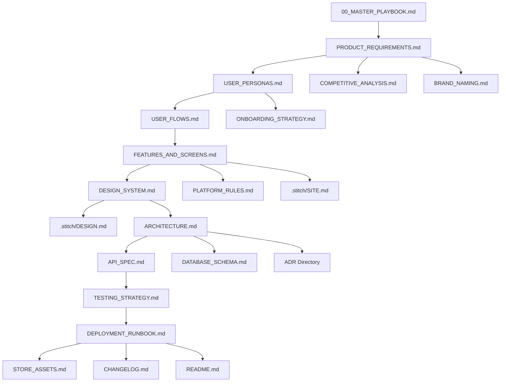

# Documentation Index — Sadhana

> **Skill Used:** `wiki-architect` — Hierarchical catalogue of all project documentation.
> **Last Updated:** Phase 2 Prompt 2.3

---

## How to Use This Index

This is the **table of contents** for the entire project's documentation. Every document produced by agents is catalogued here with its path, purpose, phase of creation, and responsible skill.

- ✅ = Document exists and is approved
- 🔲 = Document is planned but not yet created
- 🔄 = Document exists but is in draft / needs review

---

## 1. Playbook & Orchestration

> The meta-layer: how agents work, what they build, and when.

| Status | Document | Path | Phase |
|--------|----------|------|-------|
| ✅ | Master Playbook | [`00_MASTER_PLAYBOOK.md`](../playbook/00_MASTER_PLAYBOOK.md) | 0 |
| ✅ | Document Index | [`01_DOCUMENT_INDEX.md`](../playbook/01_DOCUMENT_INDEX.md) | 0 |
| ✅ | Skill Quick-Reference | [`02_SKILL_QUICKREF.md`](../playbook/02_SKILL_QUICKREF.md) | 0 |
| ✅ | Phase Prompts Guide | [`03_PHASE_PROMPTS.md`](../playbook/03_PHASE_PROMPTS.md) | 0 |
| ✅ | Founder's Checklist | [`04_FOUNDER_CHECKLIST.md`](../playbook/04_FOUNDER_CHECKLIST.md) | 0 |

---

## 2. Product & Research

> What we're building, for whom, and why it wins.

| Status | Document | Path | Phase |
|--------|----------|------|-------|
| ✅ | Product Requirements (PRD) | [`PRODUCT_REQUIREMENTS.md`](../PRODUCT_REQUIREMENTS.md) | 1 |
| ✅ | Competitive Analysis | [`research/COMPETITIVE_ANALYSIS.md`](../research/COMPETITIVE_ANALYSIS.md) | 1 |
| ✅ | Brand & Naming | [`research/BRAND_NAMING.md`](../research/BRAND_NAMING.md) | 1 |

---

## 3. UX & User Research

> Who uses the app and how they navigate it.

| Status | Document | Path | Phase |
|--------|----------|------|-------|
| ✅ | User Personas | [`ux/USER_PERSONAS.md`](../ux/USER_PERSONAS.md) | 2 |
| ✅ | User Flows | [`ux/USER_FLOWS.md`](../ux/USER_FLOWS.md) | 2 |
| ✅ | Onboarding Strategy | [`ux/ONBOARDING_STRATEGY.md`](../ux/ONBOARDING_STRATEGY.md) | 2 |
| ✅ | Features & Screens | [`ux/FEATURES_AND_SCREENS.md`](../ux/FEATURES_AND_SCREENS.md) | 2 |

---

## 4. Design System

> Visual identity, tokens, and UI generation config.

| Status | Document | Path | Phase |
|--------|----------|------|-------|
| ✅ | Design System | [`design/DESIGN_SYSTEM.md`](../design/DESIGN_SYSTEM.md) | 3 |
| ✅ | Platform Rules (HIG + Material) | [`PLATFORM_RULES.md`](../PLATFORM_RULES.md) | 2 |
| ✅ | Stitch Design Config | [`.stitch/DESIGN.md`](../../.stitch/DESIGN.md) | 3 |
| ✅ | Stitch Site Map | [`.stitch/SITE.md`](../../.stitch/SITE.md) | 3 |

---

## 5. Architecture & Technical

> How the system is built — schema, APIs, and decisions.

| Status | Document | Path | Phase |
|--------|----------|------|-------|
| 🔲 | Architecture Overview | [`architecture/ARCHITECTURE.md`](../architecture/ARCHITECTURE.md) | 4 |
| 🔲 | API Specification | [`architecture/API_SPEC.md`](../architecture/API_SPEC.md) | 4 |
| 🔲 | Database Schema | [`architecture/DATABASE_SCHEMA.md`](../architecture/DATABASE_SCHEMA.md) | 4 |
| 🔲 | ADR-001: Tech Stack | [`architecture/ADR/ADR-001-tech-stack-selection.md`](../architecture/ADR/ADR-001-tech-stack-selection.md) | 4 |
| 🔲 | ADR-002: Auth Strategy | [`architecture/ADR/ADR-002-auth-strategy.md`](../architecture/ADR/ADR-002-auth-strategy.md) | 4 |
| 🔲 | ADR-003: State Management | [`architecture/ADR/ADR-003-state-management.md`](../architecture/ADR/ADR-003-state-management.md) | 4 |
| 🔲 | ADR-004: Navigation | [`architecture/ADR/ADR-004-navigation-pattern.md`](../architecture/ADR/ADR-004-navigation-pattern.md) | 5 |
| 🔲 | ADR-005: Payment Provider | [`architecture/ADR/ADR-005-payment-provider.md`](../architecture/ADR/ADR-005-payment-provider.md) | 6 |

---

## 6. Testing & Quality

> How we verify everything works.

| Status | Document | Path | Phase |
|--------|----------|------|-------|
| 🔲 | Testing Strategy | [`TESTING_STRATEGY.md`](../TESTING_STRATEGY.md) | 8 |

---

## 7. Deployment & Launch

> How we ship and maintain.

| Status | Document | Path | Phase |
|--------|----------|------|-------|
| 🔲 | Deployment Runbook | [`DEPLOYMENT_RUNBOOK.md`](../DEPLOYMENT_RUNBOOK.md) | 9 |
| 🔲 | Store Listing Assets | [`launch/STORE_ASSETS.md`](../launch/STORE_ASSETS.md) | 9 |
| 🔲 | Changelog | [`CHANGELOG.md`](../../CHANGELOG.md) | 9 |
| 🔲 | README | [`README.md`](../../README.md) | 9 |

---

## 8. Working Memory (Project Root)

> Ephemeral-but-persisted files that agents use for context across sessions.

| Status | File | Path | Update Frequency |
|--------|------|------|-----------------|
| ✅ | Task Plan | [`task_plan.md`](../../task_plan.md) | After every phase |
| ✅ | Findings | [`findings.md`](../../findings.md) | After any discovery |
| ✅ | Progress | [`progress.md`](../../progress.md) | Every session |
| ✅ | AI Context | [`llms.txt`](../../llms.txt) | After major changes |

---

## Document Dependency Graph

---

## Maintenance Rules

1. **Update this index** whenever a new document is created or status changes
2. **Use the status emojis** consistently: ✅ 🔲 🔄
3. **Add new ADRs** as they are created (the ADR list will grow beyond the initial 5)
4. **Phase column** tracks when the document should be created — don't create docs early
