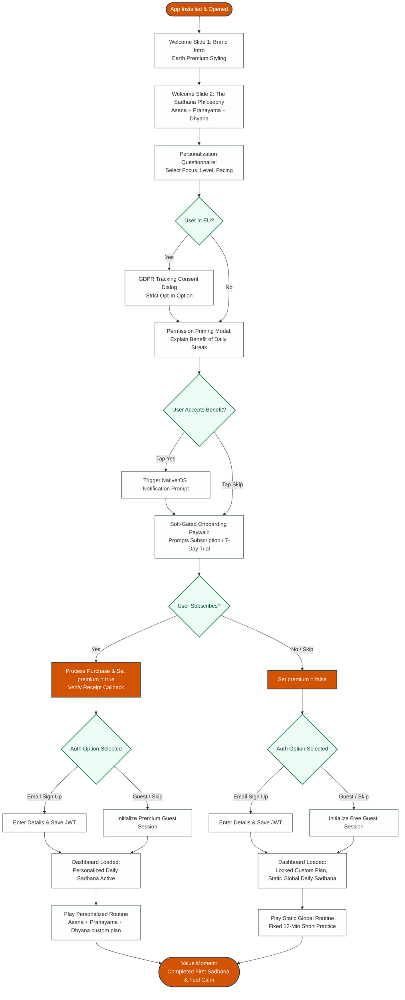
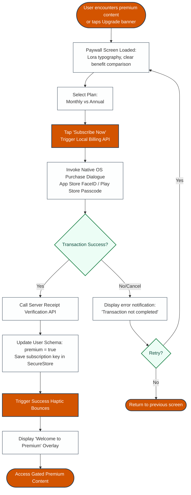
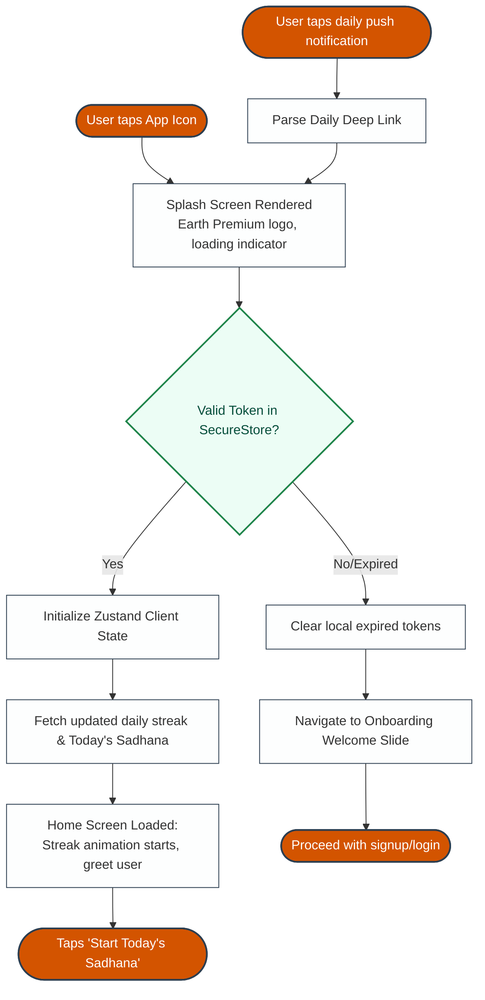
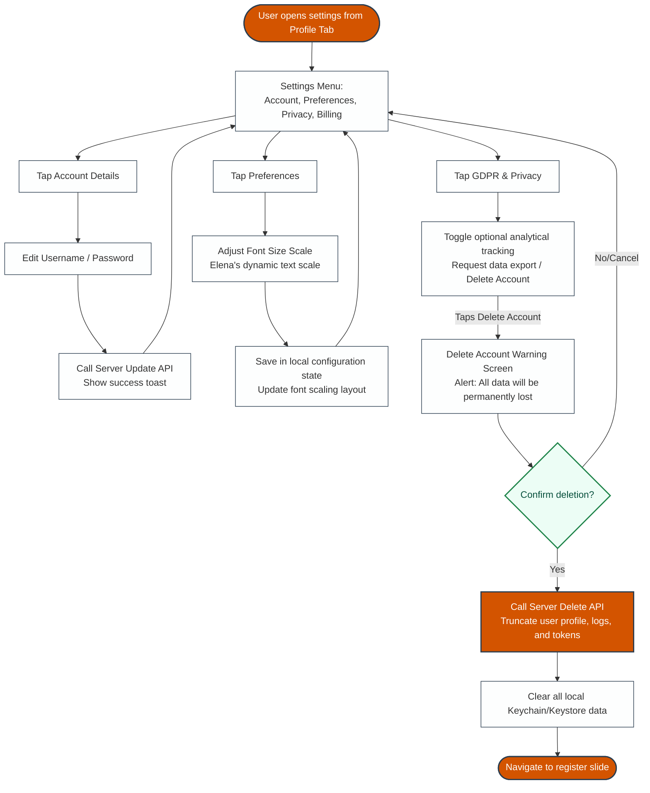
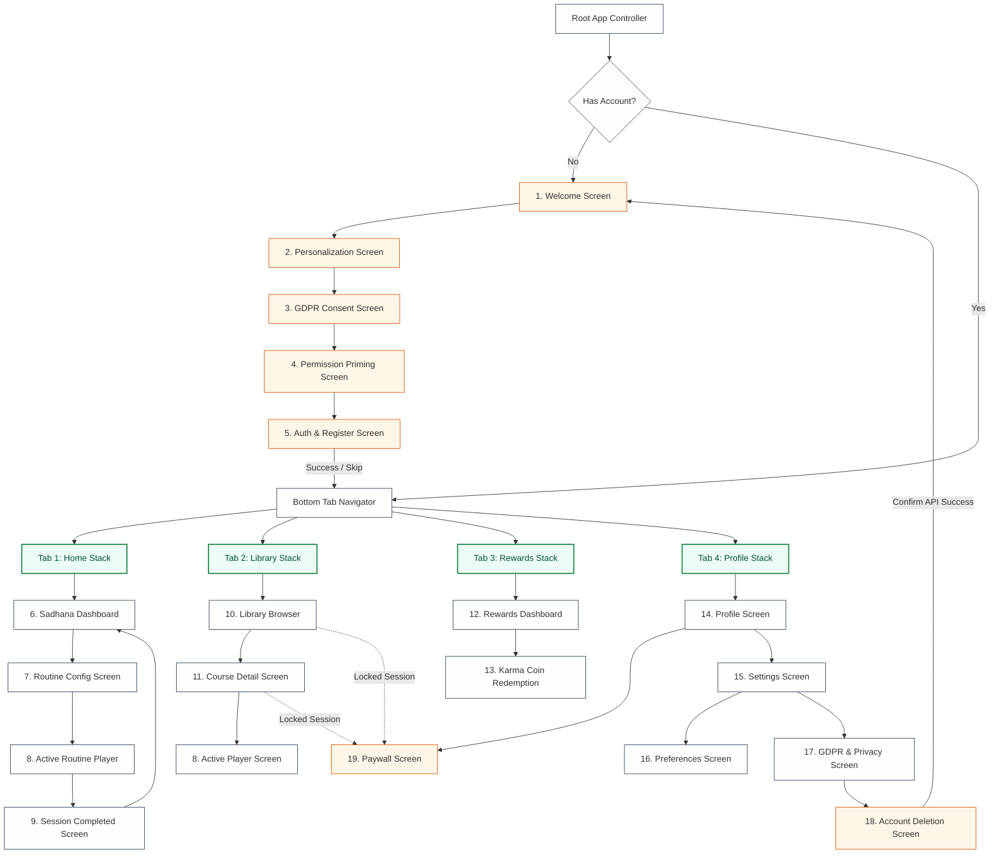

# User Flows & Screen Inventory — Sadhana

> **Phase:** 2 (UX Research & Information Architecture)
> **Skills Applied:** `ui-ux-pro-max`, `mobile-design`, `onboarding-psychologist`, `marketing-psychology`
> **Last Updated:** 2026-06-15
> **Status:** Completed

---

## 1. User Journey Flows (Mermaid Diagrams)

These user flows trace key journeys through the **Sadhana** mobile experience. They specify decision nodes, loading states, and platform-specific behaviors (such as iOS haptics or Android system back gestures).

### Flow A: First-Time User Onboarding & Paywall Gating
This journey shows the progression from initial install to the core "value moment" (completing the first short Sadhana routine). It handles the onboarding personalization questionnaire, GDPR checks, notification priming, the soft-gated paywall, and routes users to either a custom Personalized Plan (Premium) or a static Global Plan (Free).



---

### Flow B: Primary Action Flow (Daily Sadhana Routine)
This represents the daily active loop: opening the dashboard, playing the integrated physical, breathing, and meditative routines, and processing the reward triggers based on subscription status.

```mermaid
flowchart TD
    Start([App Opened to Home Tab]) --> CheckStreak[Animate Daily Streak Counter\n🔥 Greet user: 'Hari Om']
    CheckStreak --> TodaySadhana[Today's Sadhana Card Displayed\nPostures + Breath + Silence]
    TodaySadhana --> TapSadhana[Tap Card] --> ConfigScreen[Routine Player Config:\nDuration, Off-line cached status]
    
    ConfigScreen --> TapStart[Tap Start Practice\nTrigger iOS/Android Medium Haptic] --> PlayAsana[Active Player: Asana (Video)\nFlowing stretches, 60fps transitions]
    
    PlayAsana --> AutoTransition1[Auto-Transition:\nFade video to static art] --> PlayPranayama[Active Player: Pranayama (Audio)\nSoothing voice, Sanskrit translation toggle]
    
    PlayPranayama --> AutoTransition2[Auto-Transition:\nAmbient visualizer active] --> PlayDhyana[Active Player: Dhyana (Meditation)\nSilent timer, soft background sitar]
    
    PlayDhyana --> CompleteSession[Routine Completed!\nTrigger db write: session logs]
    
    CompleteSession --> UserTier{User Tier?}
    
    UserTier -- Free Tier --> FetchAd[Request Interstitial Ad] --> DisplayAd[Render Full-Screen Ad\nStart 10s Countdown Timer]
    DisplayAd --> TimerCheck{Timer = 0?}
    TimerCheck -- No --> WaitTimer[Disable & Hide Close Button] --> TimerCheck
    TimerCheck -- Yes --> EnableClose[Show Close/Skip Button] --> TapClose[User Taps Close] --> DismissAd[Dismiss Ad & Call Server Callback] --> Confetti
    
    UserTier -- Premium Tier --> AddCoins[Add 30 Karma Coins to Wallet\nLocal State + Secure Db Write] --> Confetti
    
    Confetti[Confetti Animation Screen:\nShow Updated Stats & Streaks] --> BackHome([Back to Dashboard])

    classDef default fill:#FDFEFE,stroke:#2C3E50,stroke-width:1px;
    classDef action fill:#D35400,stroke:#2C3E50,stroke-width:2px,color:#FDFEFE;
    classDef decision fill:#ECFDF5,stroke:#1E8449,stroke-width:2px,color:#064E3B;
    class CheckStreak,TodaySadhana,ConfigScreen,PlayAsana,PlayPranayama,PlayDhyana,CompleteSession,WaitTimer,EnableClose,DismissAd,Confetti default;
    class Start,TapSadhana,TapStart,TapClose,BackHome action;
    class UserTier,TimerCheck decision;
```

---

### Flow C: Purchase & Upgrade Flow
The journey a free user takes when encountering locked premium content, launching the paywall, completing local App Store/Google Play billing, and updating application permissions.



---

### Flow D: Return User Flow
Traces how a returning user re-enters the application—either directly or via a daily push reminder—checks session validity, and loads their dynamic dashboard.



---

### Flow E: Settings & Account Management
Allows the user to manage settings, adjust accessibility typography scales, edit GDPR settings, or confirm permanent account deletion.



---

## 2. Screen Inventory

This is a numbered inventory of every screen in the **Sadhana** MVP. It specifies each screen's purpose, navigation parent, and core interactive components.

### Navigation Section A: Onboarding Stack (Modal Flow)
1.  **Welcome Screen**
    *   *Purpose:* Introduce brand tagline ("Your Daily Mind-Body Sanctuary") and visual tone.
    *   *Parent:* None (Root on first open).
    *   *Key Components:* Swipeable card slideshow, Terracotta logo icon, "Get Started" call-to-action button, "I already have an account" login text link.
2.  **Personalization Screen**
    *   *Purpose:* Gather user preferences to construct the dynamic daily schedule.
    *   *Parent:* Welcome Screen.
    *   *Key Components:* Progress bar, multi-select question buttons (Focus: stress, sleep, mobility), skill level selectors (Beginner, Intermediate, Advanced), "Continue" button.
3.  **GDPR Consent Screen**
    *   *Purpose:* Secure legal tracking and data collection consent for EU users.
    *   *Parent:* Personalization Screen.
    *   *Key Components:* Descriptive legal copy (large, clear Lora font), "Agree to All" primary button, "Manage Options" secondary button.
4.  **Permission Priming Screen**
    *   *Purpose:* Contextualize *why* system notification alerts benefit the user's daily habits before calling native prompts.
    *   *Parent:* GDPR Consent Screen.
    *   *Key Components:* Visual mock calendar graphic displaying a streak of flame icons, "Allow Reminders" button, "Skip" text link.
5.  **Authentication & Register Screen**
    *   *Purpose:* Create a user account or sign in.
    *   *Parent:* Permission Priming Screen.
    *   *Key Components:* Email text input field, password input field (with toggle visibility icon), "Create Account" primary button, "Skip for Now (Guest)" text link.

### Navigation Section B: Home Tab Stack (Primary Tab)
6.  **Sadhana Dashboard (Home Screen)**
    *   *Purpose:* The central hub displaying daily streak status, quick routine access, and notifications.
    *   *Parent:* Root Tab Controller.
    *   *Key Components:* Animated Streak Flame counter (🔥), Today's Sadhana Card (displays customized Personalized Plan for Premium; displays locked custom plan badge and routes to static "Global Daily Sadhana" for Free), "Recent Sessions" horizontal list, dynamic greeting text ("Hari Om, [Name]").
7.  **Routine Config Screen**
    *   *Purpose:* Preview and configure the selected Sadhana routine before starting.
    *   *Parent:* Sadhana Dashboard.
    *   *Key Components:* Summary of the routine (dynamic personalized segments for Premium; fixed global segments for Free), total duration indicator, offline cache toggle switch (Premium only), "Start Sadhana" primary CTA button.
8.  **Active Routine Player Screen**
    *   *Purpose:* A clean, high-performance media player that plays physical sequences and guides breathing/meditation.
    *   *Parent:* Routine Config Screen.
    *   *Key Components:* High-definition video player (active for Asana), static art display (active for Pranayama/Dhyana), ambient audio player visualizer, play/pause controls, seek slider, Sanskrit word tooltips, full-screen orientation toggle.
9.  **Session Completed Screen**
    *   *Purpose:* Congratulate user, present stats, and trigger reward milestones or ad placement.
    *   *Parent:* Active Routine Player Screen.
    *   *Key Components:* In-app confetti particles, session statistics (minutes completed, daily streak count), "Claim Rewards" button, Full-screen ad interstitial container (conditional for Free tier with countdown and close buttons).

### Navigation Section C: Library Tab Stack (Discovery Tab)
10. **Library Browser Screen**
    *   *Purpose:* Explore single yoga practices, meditations, breathwork, and philosophy guides.
    *   *Parent:* Root Tab Controller.
    *   *Key Components:* Category filter chips (Asana, Pranayama, Dhyana, Philosophy), search bar, horizontal scrolling featured carousels, vertical grid of course listing cards.
11. **Course Detail Screen**
    *   *Purpose:* Review course outline, lessons list, and enroll.
    *   *Parent:* Library Browser Screen.
    *   *Key Components:* Prominent course header image, instructor bio panel, course description text, vertical list of lessons (unlocked/locked icons), "Enroll / Play Lesson 1" button.

### Navigation Section D: Rewards Tab Stack (Incentives Tab)
12. **Rewards Dashboard Screen**
    *   *Purpose:* Track ad-milestones, wallet balances, and active unlocking options.
    *   *Parent:* Root Tab Controller.
    *   *Key Components:* Monthly ad-view progress bar (0 to 50 milestones), "Karma Coins" balance card (Premium only), "Watch Rewarded Ad" CTA button, unlock choices grid.
13. **Karma Coins Redemption Screen**
    *   *Purpose:* Allow Premium users to exchange points for subscription discounts or donations.
    *   *Parent:* Rewards Dashboard Screen.
    *   *Key Components:* Balance summary, redemption option list (e.g., "$5 off renewal" card, "Indian Script Preservation Donation" button), Confirmation dialog overlay.

### Navigation Section E: Profile & Settings Stack (Settings Tab)
14. **Profile Dashboard Screen**
    *   *Purpose:* Display user identity, progress graphs, and calendar heatmaps.
    *   *Parent:* Root Tab Controller.
    *   *Key Components:* User profile photo and name card, calendar streak heatmap, total time stats panel, Settings gear icon (navigates to settings stack).
15. **Settings Screen**
    *   *Purpose:* The central portal for editing details and preferences.
    *   *Parent:* Profile Dashboard Screen.
    *   *Key Components:* Vertical list of setting buttons (Account Details, App Preferences, GDPR & Privacy, Help & Support).
16. **Preferences Screen**
    *   *Purpose:* Configure styling and accessibility scaling.
    *   *Parent:* Settings Screen.
    *   *Key Components:* Accessibility font size slider, language selection picker, push notification reminder time picker.
17. **GDPR & Privacy Screen**
    *   *Purpose:* Manage data safety and privacy.
    *   *Parent:* Settings Screen.
    *   *Key Components:* Optional analytical tracking toggle, "Export Account Data" button, "Delete Account" button (navigates to confirmation).
18. **Account Deletion Confirmation Screen**
    *   *Purpose:* Verify permanent account deletion.
    *   *Parent:* GDPR & Privacy Screen.
    *   *Key Components:* Bold warning text, "Confirm Deletion" button, "Cancel" button.
19. **Paywall Screen (Subscription Gating Screen)**
    *   *Purpose:* Present features of Premium tier and handle subscriptions.
    *   *Parent:* Profile Dashboard Screen (or triggered via locked content).
    *   *Key Components:* Clear feature benefit comparison table, plan pricing cards (monthly vs annual), "Start Free Trial" button, "Restore Purchase" text link.

---

## 3. Navigation Map (Mermaid Diagram)

This map shows the layout of Sadhana's screens, tracking tab transitions, modal stacks, and routing options.


